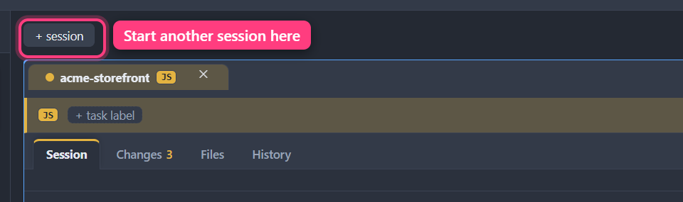
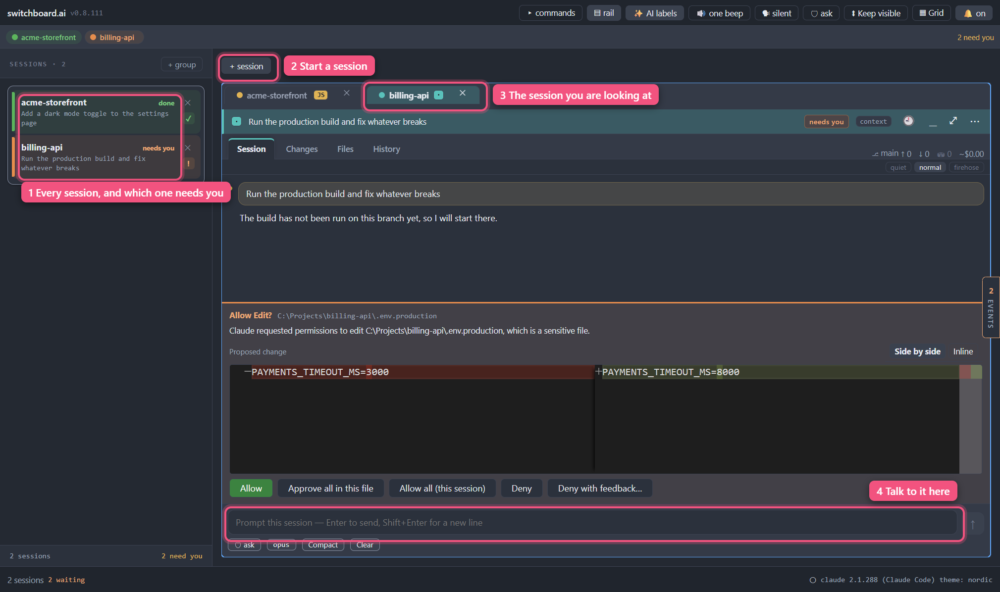

<p align="right"><a href="contents.md">☰ Contents</a></p>

# Getting started

> Status: draft

switchboard.ai runs many Claude Code sessions side by side in one window —
each pointed at its own project folder — so you stop juggling a dozen terminal
windows and can see, at a glance, which one needs you.

## Before you start

You need **Claude Code** installed and signed in. switchboard runs *your*
`claude` command on *your* subscription: there's no API key to enter, no
account to create, and nothing is sent to us.

```
npm install -g @anthropic-ai/claude-code
```

Then run `claude` once in a terminal and sign in. If switchboard can't find it,
a banner appears along the top of the window and new sessions are disabled
until it's sorted.

TODO: where to download switchboard itself, per platform (no public release
yet).

## Your first session



*Where a new session starts.*

1. Click **+ session** at the top of the Sessions list, on the left. (With
   nothing open yet, the middle of the window also says **No sessions open**
   and has a **Start a session** button that does the same thing.)
2. Pick the project folder you want Claude to work in.
3. A card appears and Claude starts up inside it. The first moments show
   *starting*; once it's ready the status changes to *idle*.
4. Type into the box at the bottom of the card and press **Enter**.

You can also drag a folder from your file manager straight onto the window —
same result, no dialog.

## What you're looking at



*The whole window. The numbers match the labels.*

- **Title bar** (top) — the version and build code on the left (click it to see
  exactly which build you're running — see
  [Troubleshooting](11-troubleshooting.md#which-version-am-i-running)), then
  app-wide switches: trust, task labels, sounds, spoken announcements,
  notifications, the autonomy mode new sessions start in, and how the
  workspace is arranged. Everything you set once and forget — theme, language,
  quiet hours, phone push — is in the Settings window instead: press
  **`Ctrl+,`**. See [Settings](10-settings.md).
- **Sessions** (left) — every session you have open, with a colored status dot.
  Click one to jump to it.
- **The grid** (middle) — the session cards themselves. Each has its own tabs:
  Session, Changes, Files, History.
- **Events** (right) — what needs you right now. Empty is good; it says
  "Nothing needs you right now".
- **Status bar** (bottom) — how many sessions are open, total tokens and
  estimated cost, the Claude Code version, and the current theme.

<!-- screenshot: the whole window with two or three live sessions -->

## Good to know

- Your sessions, layout, and window position come back when you reopen the app.
- **Only one copy runs at a time.** Launch switchboard again — from the icon,
  the taskbar, wherever — and the window you already have comes forward instead
  of a second copy opening. That's on purpose: two copies would share the same
  saved sessions and quietly tread on each other. Everything already running
  keeps running; nothing restarts.
- Nothing leaves your machine. There's no cloud sync, no telemetry, no login.
- If switchboard itself breaks, your sessions keep running — the real `claude`
  is doing the work, not us. Sessions talk to it in
  [Direct mode](12-direct-mode.md) and there is no terminal inside the app to
  drop into, so the fallback is a terminal of your own: run `claude` in the same
  project folder. It is the same CLI, with the same conversation history.

---

[← Back to Contents](contents.md)
