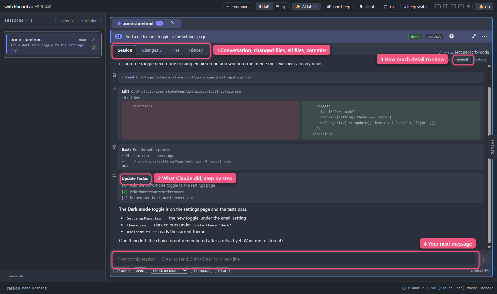
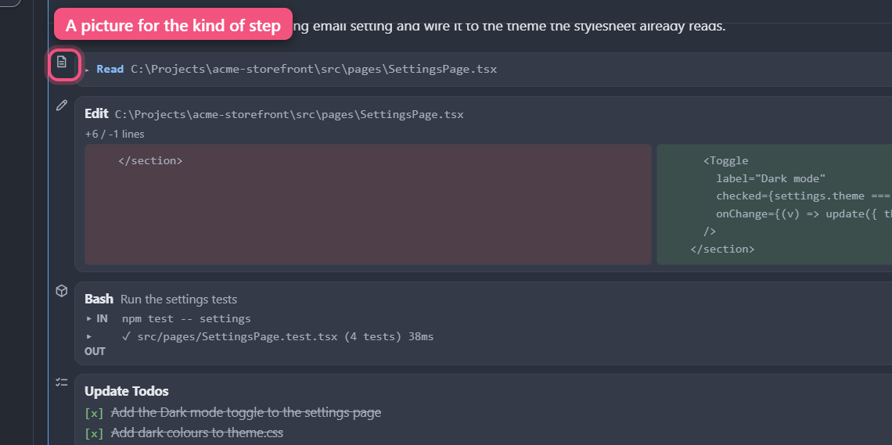
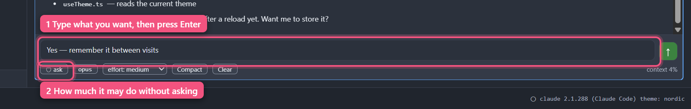
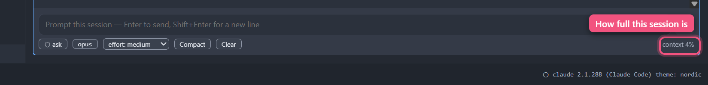

<a href="contents.md">☰ Contents</a>

# The session view

> Status: draft

Each card has four tabs: **Session**, **Changes**, **Files** and **History**.
Session is the one you'll live in; **Files** shows what's in the session's folder
and is covered in [The Files tab](21-files.md).

## Which session is open

When several sessions are docked together, each one has a tab along the top
with its name on it. **The open tab is shaded in that session's own colour**
(the same colour as its badge), and so is the bar right under it, the **card
header**. The two read as one piece. The open tab's name is bold. The other
tabs have no shading and lighter text.

If you've split the window into side-by-side groups, each group's open tab is
shaded, because that's what the group is showing. Only the group you're
working in has its tab name in bold, and that group also has a blue frame
around it.

The card header doesn't repeat the session's name, because the tab right above
it already shows it. The header shows:

- the session's **badge**, filled in its colour;
- its **task label**, or **+ task label** if it doesn't have one yet (click it
  to type one);
- its status, and the card's buttons, over on the right.

Double-click an empty part of the header to maximize the session. Double-click
again to put the layout back.

## The Session tab

*One finished turn, read top to bottom.*

This is the conversation, rendered to be read rather than scrolled past:

- **Your prompts** appear as tinted boxes. Each one starts a new turn, and the
  conversation says so: a full-width rule with **NEW PROMPT** under it, with a
  gap above. It's there so you can scroll a long session and find where each
  exchange began without reading a word of it.
- **Claude's replies** are formatted text, with no marker in the left margin —
  they're the answer, not something that happened, so they sit clean.
- **Anything Claude *did*** — running a command, editing a file, reading
  something, updating its checklist — is a **bordered box** with a small dot in
  the margin beside it. The boxes are what you scan for when you want to know
  what a session has been up to.
- **File edits** show the filename, a `+3 / -1 lines` summary, and the changed
  lines in red and green.
- **Commands** show what was run and why, with **IN** and **OUT** sections you
  can expand separately.
- **A burst of looking around is one box.** When Claude reads files and
  searches the project several times in a row — three or more **Read**,
  **Grep** or **Glob** calls with nothing else between them — you get a single
  box instead of a screenful: **Explored the code**, how many searches and how
  many files read, and the most recent one. Click it (or press Enter on it) to
  see every call, each drawn exactly as it would have been on its own; click
  again to fold them away. While Claude is still looking, the counts go up in
  place.

  An edit or a helper being sent out always gets its own box. So does a single
  Read, or two. And a sentence from Claude in the middle of a burst splits it
  into two boxes with the sentence between them.
- **A run of commands is one box too.** Three or more commands in a row, with
  nothing else between them, become **Ran**, how many commands, and what the
  most recent one was for. Click it (or press Enter on it) to see each one,
  with its **IN** and **OUT**, exactly as before.

  **A command that failed is never folded away.** It keeps its own box, in
  full, with **failed** in red on its title line, in the place where it
  happened. Twelve commands with one failure in the middle are *Ran 5
  commands*, the failed one, *Ran 6 commands*. You never have to open anything
  to find out that something went wrong. (A command counts as failed when
  Claude Code itself reports it so: it exited with an error, it was blocked,
  or nobody approved it.)

  Commands and looking around are never mixed in one box.

  `Ctrl+F` still finds text inside a folded burst: stepping to a match there
  opens the box.

  Opening one of these boxes stops the conversation following its newest
  message, so the box stays where you clicked it while you read. **Jump to
  latest** takes you back, and shutting the box at the bottom of the
  conversation carries on following by itself.
- **Thinking** collapses to "Thought for 4s" — expand if you care.
- **Checklists** from Claude's own task tracking render as `[x]` / `[~]` / `[ ]`.
- **Local commands** — `/usage`, `/cost`, `/context` and the like, which Claude
  Code answers itself — print their output here too.
- **A slash command you ran** collapses to a single line showing the command and
  what you gave it — `/next-item 818` rather than just `/next-item`. Click it to
  see the whole thing. If what you gave it was long (a whole briefing pasted in,
  say), the line is shortened with an `…`; the full text is inside.

The view stays pinned to the newest message, including when you switch back to
a session you'd left. Scroll up freely; it won't yank you back.

**Only scrolling unsticks it.** Clicking inside the conversation — expanding a tool
box, pressing a **Copy** button, clicking to put the keyboard focus there — leaves the
view following, even while Claude is writing flat out. That used to be the one case
where a busy session quietly stopped keeping up: a click while output was pouring in
could be mistaken for scrolling away. The same goes for scrolling *down*, and for
pressing a key like `Shift` or `Ctrl+C` — none of them can take you away from the
newest message, so none of them stops the view following it, however long the
conversation has grown.

If a conversation ever does stop following and you didn't scroll up, that's a
bug worth reporting: **Help ▸ Report a problem…** sends the app's log, and the
log records what the view thought you did.

That holds across the things that move a card around, too: quitting and
reopening switchboard, clicking a session in the Sessions list, and dragging cards
into a different arrangement all leave each conversation showing its latest
message rather than its first. The one thing that doesn't put you at the
bottom is scrolling up yourself — which is the point, and which the button
below undoes.

**When you've scrolled away, a `↓ Jump to latest` button appears** just above
the prompt box. Scrolling up — with the wheel, or by walking the conversation
with the arrow keys — deliberately unsticks the view so that new output can't
drag you off what you're reading, and that button is how you stick it back on:
one click and the view is at the newest message and following again. It only
shows while there's somewhere to go, so a conversation short enough to fit never
has one. Scrolling all the way back down by hand does exactly the same thing.

From the keyboard it's one `Tab` from the conversation (press `Esc` first if
you're walking the boxes) and one `Shift+Tab` from the prompt box — see
[Reading the conversation with the keyboard](06-keyboard.md#reading-the-conversation-with-the-keyboard).

**Replies stream in a word at a time**, with a small block cursor on the end
while Claude is still writing — see [Direct mode](12-direct-mode.md).

**A reply is formatted while it arrives, not after it finishes.** Headings,
bold, bullet lists, tables and code blocks all appear as Claude writes them, so
a long answer reads like an answer the whole way down instead of showing you
raw `##` and `**` markers and then rearranging itself at the end.

Two things about that are worth knowing, because both are deliberate:

- **Some text briefly restyles itself as Claude types.** A word can appear
  plain for an instant and then turn bold once the closing `**` arrives, and a
  line that becomes a table header sits as ordinary text until the row beneath
  it shows up. That settling is unavoidable — half a sentence genuinely is
  ambiguous — and it stops as soon as the syntax is complete.
- **Code blocks get their Copy button when the reply ends**, not while it is
  still being written. The code itself appears as it arrives; only the button
  waits. That's on purpose: copying a command that is still half-written would
  put half a command on your clipboard with nothing to tell you so.

### The small picture beside each step

Down the left edge of the conversation, where there used to be a grey dot,
each thing Claude did has a small picture of what kind of step it was. You can
run your eye down that margin and tell them apart by shape, without reading.
The box beside it shows the tool's name and what it was used on, as before.

| Picture | What it marks |
|---|---|
| A little robot | Claude handed work to a helper (an agent) |
| A speech bubble with a question mark | Claude asked you a question |
| A page | It read a file |
| A magnifying glass | It searched (for files, or for text in them) |
| Two magnifying glasses | A burst of reading and searching, folded into one box |
| A pencil | It edited a file |
| A page with a plus | It wrote a new file |
| A notebook | It changed a notebook |
| A terminal window | It ran a command (see below) |
| A ticked list | It updated its to-do list |
| A globe | It fetched a web page or searched the web |
| A plug | It used a tool from a connected server (an MCP tool) |
| A plain dot | A tool switchboard doesn't have a picture for |

**A command says what it ran.** When the command starts with a program
switchboard knows, the terminal picture is replaced by that program's:

| Picture | The command starts with |
|---|---|
| A branch | `git`, `gh` |
| A hexagon | `npm`, `npx`, `node`, `pnpm`, `yarn`, `bun` |
| Two interlocked hooks | `python`, `py`, `pip`, `uv` |
| A slanted terminal | `powershell`, `pwsh` (and anything run with the PowerShell tool) |
| Stacked blocks | `docker`, `podman` |

It looks only at the first word (after any `NAME=value` settings in front), so
`git add -A && npm test` is a git step. Anything else keeps the terminal.

**Your own prompts keep their dot**, and so does plain text from Claude,
which never had one.

The pictures are all one grey. The colour tells you nothing; the shape does.

### Expanding a box

**Click anywhere on a box to open or close it.** You don't have to hit the
title — the whole rectangle is the target. On a command box that shows you the
full command and its full output in one click.

Two things deliberately *don't* fold the box away:

- The small **▸ IN** / **▸ OUT** arrows inside a command box, and the diff panes
  inside an edit box. Those control just their own section, so you can open the
  output without the command, or scroll a long diff in peace.
- **Selecting text.** Dragging to highlight a file path or a line of output
  leaves the box exactly as it was, so you can copy it without it disappearing.

Checklist boxes have nothing to expand — they're already showing everything —
so clicking one does nothing.

### A question Claude asked you, afterwards

While a question is open it has its own panel above the prompt box (see [When
Claude asks you a question](04-approvals-and-autonomy.md#when-claude-asks-you-a-question)).
Once it is answered, it stays in the conversation as a box you can read back:

- **Each question as a sentence**, with its short label beside it.
- **Every answer that was offered**, with a **✓** and bold type on the ones
  you chose. If you ticked several, all of them are marked.
- **Typed instead:** and your own words, if you typed an answer rather than
  picking one.
- **Skipped**, for a question you left unanswered.
- **Note:** and the note, if you left one beside an answer in another app
  that has that.
- At the top, **answered**, **answered in their own words** (you replied with
  text instead of using the choices), **not answered** (you declined, or it
  ran out of time; the reason is shown underneath) or **waiting for an
  answer**.

If an answer was very long, the record of it can be cut short. The box then
says so under the questions it could not read, rather than calling them
skipped; the title line still opens everything there is.

It looks the same when you scroll back to it later, and the same after you
quit and reopen the session.

Click the box's title line to see the request exactly as Claude sent it. That
is the same click every other box uses to show its detail; here it is only for
when the box looks wrong. Clicking or selecting text in the answers does not
fold anything.

### Copying code out of a session

**Code blocks in an answer have a small header with a Copy button on the
right.** Click it and the whole block is on your clipboard — exactly the text,
with no line numbers or extra spacing. The button says **Copied** for a moment
so you know it worked. The language of the block, if the answer said what it
was, sits on the left of the same strip.

**Command boxes get one too, once they're open.** Open a command box and each
**IN** and **OUT** section gets its own Copy button at the right — **IN** copies
the command, **OUT** copies the whole output, including the lines below the one
the collapsed box was showing you. A closed section has no button: there is
nothing on screen yet to copy.

Copying never folds the box away, and the buttons are reachable from the
keyboard along with everything else (below). It works in a popped-out card too.

The document viewer has had the same button on its code blocks since it
shipped — it's the same affordance in both places, on purpose.

### Opening a link a session gives you

**Click a link in an answer and it opens in your normal web browser.** It never
opens inside switchboard.ai — the app doesn't turn into a web page, and you
don't lose the session you were reading. It works in a popped-out card too.

Only ordinary web links work: `http`, `https` and `mailto` addresses. Anything
else in a link — a scheme that would run a program, open a file on your disk, or
launch another app — does **nothing at all** when clicked, and isn't painted as
a link in the first place: it reads as the plain words it always was. That's
deliberate:
the text of an answer is written by whatever the session was reading, so a link
in it is not automatically something worth trusting, and "nothing happened" is
the right answer for anything that isn't plainly a web page.

Two other things a link in an answer can't do, for the same reason: a link to a
file path (`./notes.md`) doesn't open anything from the conversation — open it
in the [document viewer](15-document-viewer.md) instead, where links between
files do work — and a link that just points at a spot in a page (`#somewhere`)
does nothing, because a conversation isn't a document with places to jump to.

### …without the mouse

Every box, every **IN** / **OUT** section and every folded prompt can be opened
from the keyboard. `Tab` into the conversation, then `↑` and `↓` walk between
the things that open — and the Copy buttons on code — and `Enter` opens or
presses the one you're on. Full instructions:
[Reading the conversation with the keyboard](06-keyboard.md#reading-the-conversation-with-the-keyboard).

## When the Session tab has nothing in it

An empty Session tab is usually normal, so it tells you which kind of empty it
is rather than leaving you guessing:

- **"No conversation yet"** — the session is up and waiting. Claude Code
  doesn't start writing a conversation until you send your first prompt, so a
  card you've just opened sits here, however long you leave it. Nothing is
  wrong.
- **"Looking for this session's transcript…"** — you've sent something and
  switchboard is matching the conversation to this card. It normally passes in
  a moment.
- **"Couldn't find this session's transcript"** — shown in red, and the only
  one that means something is actually wrong. It tells you where it looked and
  what it found. **Your session is unaffected**, and you don't need to go
  anywhere to keep working: its replies come straight into this window
  ([Direct mode](12-direct-mode.md)) rather than being read out of that file,
  and the status on the card header tells you what it's doing. The missing file
  only costs you usage totals and picking the conversation back up next time you
  open switchboard.

  See [Troubleshooting](11-troubleshooting.md).

If you have two cards open on the *same folder*, expect the second one to spend
a little longer on "Looking for…" — switchboard waits until it can tell the two
conversations apart rather than guessing and showing you the wrong one.

## Talking to the session

*The prompt box and the chips under it.*

The box at the bottom sends straight to the real Claude Code session:

- **Enter** sends. **Shift+Enter** starts a new line.
- The box grows to fit what you have written — including long text that wraps
  onto several lines by itself, so a pasted paragraph is never half-hidden. It
  stops growing at twelve lines and scrolls inside itself after that, and it
  shrinks back down as you delete.
- **In a short pane it stops sooner, on purpose.** The box never takes the last
  of the conversation above it, so in a small pop-out or a four-way split it
  caps below twelve lines and scrolls instead — and it gives room back the
  moment something else needs the space, such as a permission bar arriving.
  Make the pane taller and the box grows again. If the pane is too short for
  all of it, the conversation is what yields: the box keeps a line to type in
  and any buttons waiting for an answer stay on screen.
- While Claude is working, the send button becomes a **■ stop** button, which
  interrupts the current turn.
- Typing `/` at the start of a line opens command autocomplete — see
  [Slash commands](05-slash-commands.md).
- Typing **`@`** opens a list of your other open sessions, anywhere in your
  message — "take `@TradingApp`'s fix and apply it here". Each row shows the
  session's name, its folder and its colour, and a session whose process has
  ended is marked **exited** (you can still refer to it). Keep typing to narrow
  the list. **Tab** (or a click) always puts `@SessionName` into your message.
  **Enter** does too when the name *starts* with what you typed, or when you've
  moved to a row with the arrow keys — but if you've typed the whole name,
  Enter sends, and if what you typed only appears somewhere *inside* a name,
  Enter sends your text exactly as written rather than swapping in a name you
  didn't pick. **Esc** closes the list for that `@` until you start a new one.
  The session you're typing in isn't listed. The list only opens while you're
  typing at the end of the `@`-word, so clicking into a name you already wrote
  and pressing Enter just sends. An `@` inside ordinary text, like an email
  address, opens nothing and stays exactly as you typed it.
- **A mention brings a brief on that session with it.** When you send
  "take `@TradingApp`'s fix and apply it here", switchboard.ai puts a short
  brief on TradingApp in front of your message, marked as coming from
  TradingApp. In what's sent, your `@TradingApp` becomes
  `"TradingApp" (session)` — the rest of your words are unchanged. (Claude would
  otherwise read `@TradingApp` as a *file* called TradingApp.) You'll see all of
  it in your turn in the conversation, so nothing is added behind your back.
  If you mention several sessions at once and the total is too long, the ones
  you mentioned first come along and a line in your message says which were
  left out.

  The brief is put together by the app — no AI writes it — and it has four
  parts, in this order:

  1. **The facts.** Which session, which folder, whether it is working, waiting
     on you, idle, or has stopped running; which git branch its folder is on and
     how many files have uncommitted changes. **If that session works in the
     same folder as the one you are typing in, the brief says so in bold**,
     because two sessions in one folder share one set of files and one branch.
     It says the same when the two folders are different but belong to one git
     checkout — one session at the top of a project and another in a subfolder
     of it, for instance — since those share a branch and each other's
     uncommitted changes just as much. Two separate git worktrees of one
     project do not share files, and get no warning.
  2. **What it was asked to do** — its first prompt, what you asked for along
     the way, its to-do list, and the files it read and changed.
  3. **The recent conversation** — what you typed and what it replied, in full,
     with each tool it ran shown as a single line rather than everything the
     tool printed. That leaves room for many more turns of actual conversation.
  4. **How to get more.** The receiving session is told it can ask switchboard
     for the other session's full output or its uncommitted changes, so it
     fetches detail when it needs it instead of being handed everything.

  Only the recent end of a long conversation comes along, and the brief says
  when older turns were left out.

  **Or ask that session to write the handoff itself.** As soon as your message
  names another session, a small switch appears under the prompt box: **Ask
  TradingApp to write the handoff**. It is off unless you turn it on, and it is
  for that one message.

  With it on, pressing Enter does not send straight away. TradingApp is asked,
  in its own conversation, to sum up where it is for a colleague — what it was
  asked, what is done and what is not, what it decided and why, which files and
  branches matter, and what it would do next. The line under the box says
  **Waiting for TradingApp to write its handoff…** and when the answer arrives
  your message goes, with that summary at the top of the brief. Everything
  else in the brief is still there underneath it.

  What that costs, so you can decide when it is worth it:

  - **It uses a turn in the other session.** You will see the request and the
    reply in TradingApp's own conversation, marked `[switchboard: handoff
    request]`.
  - **You wait** — usually well under a minute. **Cancel** stops the wait; your
    message is then *not* sent and stays in the box, and TradingApp finishes
    writing anyway.
  - **An AI wrote that part.** The rest of the brief is facts the app can vouch
    for; the handoff is the other session's own account, and the brief tells
    the session receiving it to check what matters before leaning on it.

  **A session that is busy is never interrupted.** If TradingApp is working, or
  waiting on an answer from you, it is not asked: your message goes at once
  with the ordinary brief, and the line under the box says so. The same happens
  if it is not running, takes longer than a minute and a half, or stops to ask
  a question instead of writing — in every case you get the brief you would
  have had with the switch off, and a sentence saying why.

  If your message names several sessions, the switch asks all of them, side by
  side.
  - **It arrives folded up.** In the conversation, what came from TradingApp
    shows as a single **Context from TradingApp** row — click it to read the
    whole thing, click again to fold it away. Your own question sits underneath,
    in full, where you can actually see it. Only context switchboard.ai added is
    folded: if you paste or type something that merely looks like it, it stays on
    screen exactly as you sent it. Folding lasts for as long as the app is
    running — quit and reopen, and older messages like this show in full again.
  - **Anything that looks like a file name in the other session's text is
    defused.** Claude reads `@`-words in a message as files to open, and it would
    look for them in *your* folder — so a stray `@types/node` in somebody else's
    conversation could have attached a file, or listed a whole directory, in your
    session. Those are marked with a `\` so they read as words instead. Nothing
    is removed, and nothing you typed yourself is touched. The same goes for a
    message another session sends you and for a dragged context chip.
  - An `@` that doesn't match an open session, an email address, an `@` inside
    `` `code` `` or a code block, or the session you're typing in, is sent
    exactly as you typed it.
  - If two open sessions have the **same name**, nothing is sent: a note under
    the box lists both, with their folders, and your message stays in the box.
    Rename one, or use the session's id in place of the name.
  - If the lookup itself fails, your message is still sent as you typed it, and
    a note under the box says the other session's work didn't go with it.

Under the box is a row showing this session's **autonomy mode** (click to
cycle) and the **model** it's running — click that to switch it, or see
[Choosing a model](18-model.md). Next to the model is **effort**, which sets
[how hard the model thinks](18-model.md#how-hard-the-model-thinks). Beside
them are **Compact** and **Clear**,
which summarize or restart this session's conversation — Clear asks you to
confirm first, right there in the row. Both are also in the card's **⋯** menu
under their full names; see
[Clearing and compacting](05-slash-commands.md#clearing-and-compacting).

At the right-hand end of the same row is the **context meter**: how full this
session's memory of the conversation is, from 0 to 100%. See
[The context meter](#the-context-meter) below.

All five are buttons and look like it: each one sits in its own small
filled box with a visible edge, they are all written in the same colour, and
hovering over one lights it up. When a button can't be used — while a session
is still starting, has ended, or is busy with the thing you just asked for —
it fades and stops responding, and hovering it tells you why.

**A prompt you haven't sent yet is kept.** Start writing, then switch that card
to the Changes tab and back, pop it out into its own window, dock it back, or
quit switchboard entirely — the words are still in the box when you return to
it. Each session keeps its own; sending clears it. If you empty the box, nothing
is kept, and a draft is forgotten when you close the session for good. A session
you left suspended gets its draft back when it resumes.

**Files you attached are kept too, with one limit.** Any chips above the box
come back with the words for as long as switchboard.ai is running — moving
between tabs, popping the card out, docking it back. They do **not** survive
quitting the app, because their contents are never written to disk (see
[Attaching files](#attaching-files-paste-a-picture-or-drag-anything-in) below).
If you quit with files attached, the next launch gives you your words back and a
line under the box naming the files it could not restore, so you can attach them
again. It never empties itself quietly.

### Right-click menus

**Right-click in the prompt box** for **Cut**, **Copy**, **Paste** and **Select
All**. Items that would do nothing are greyed out — Cut and Copy with nothing
selected, Paste with an empty clipboard. Pasting from the menu is the same as
pressing Ctrl+V, pictures included: a screenshot pasted this way becomes the
same chip described below.

**Right-click text you've selected in the conversation** — or in a document —
for **Copy**. There is no Cut or Paste there: it isn't text you can edit.

The menus work in popped-out session windows too.

### Attaching files: paste a picture, or drag anything in

Two ways to send Claude a file along with your question.

**Paste a picture.** Copy an image — a screenshot, something from Paint, a
diagram from a web page — and press **Ctrl+V** in the prompt box.

**Drag files in.** Drag one or more files from Explorer (or Finder) onto the
prompt box. A dashed outline appears saying *"Drop files to attach them to your
prompt"*; let go and they attach.

Either way, a small chip appears above the box with the file's name and size —
and, for a picture, a thumbnail of it. Type your question next to it and press
Enter.

**Afterwards, the conversation remembers.** The chips clear the moment you send
— so the prompt in your session picks up a small line saying what rode with it:
*1 image attached*, or *2 images and 1 file attached*. Scrolling back a week
later, that line is what tells you Claude's reply was about a screenshot you can
no longer see. A picture sent with **nothing typed** gets an entry of its own,
rather than the reply appearing out of nowhere. The count comes from the message
that actually went to Claude, so it is never a guess — but it is only a count:
file names are not shown, and switchboard.ai keeps no copy of the files to show
you (see below).

#### What happens to each kind of file

Claude reads different files in different ways, and switchboard.ai sends each
one in the form Claude understands best:

| You attached | What Claude gets |
|---|---|
| A picture — PNG, JPEG, GIF or WebP | The image itself. Claude looks at it. |
| Text and source files — `.md`, `.txt`, `.ts`, `.py`, `.json`, `.log`, `.csv`, `LICENSE`, `Makefile`, `.gitignore` and a hundred-odd others | The **contents of the file**, exactly as written, labelled with its name. Claude reads it like a document, not like a path it has to go and open. |
| A PDF | The whole document. Claude reads it. |
| An SVG | Its source code, which Claude reads better than a picture of it. |

The full list of file types is the same one the official Claude Code extension
for VS Code uses, so anything that works there works here.

Nothing is uploaded anywhere and no copy is left on disk — the file's contents
travel with your prompt and nowhere else. That is a deliberate choice and it has
one visible consequence: **attached files do not survive quitting the app.** An
unsent prompt's words are saved (they are small, and retyping them is the
expensive part); a screenshot's pixels are not, because saving them would mean
leaving a copy of whatever you pasted sitting in switchboard.ai's own folder
until something got round to deleting it. Within a single run the chips are kept
through everything — tab switches, pop-outs, docking back. Across a restart they
are not, and the composer tells you which ones it lost:

> Not restored: diagram.png, server.log. Your typed prompt is kept when
> switchboard.ai restarts; attached files are not, because no copy of them is
> ever left on disk. Attach them again.

#### The rules

- **The ✕ on the chip removes it** before you send. Nothing is sent until you
  press Enter.
- You can attach **up to eight files** to one prompt, mixing kinds freely — a
  screenshot and two source files in the same question is fine.
- **They stay in the order you gave them**, so "compare the first with the
  second" means what it says.
- **A file on its own is a valid prompt** — the send button lights up even with
  nothing typed.
- **If your clipboard has text *and* a picture** — copying a range of
  spreadsheet cells does this — you get both: the text lands in the box and the
  picture attaches beside it.
- **Pasting ordinary text is exactly as it always was.** Nothing about this
  changes it.
- **Dragging files anywhere else in the window is unchanged.** Dropping a
  *folder* on the app still opens it as a new session; only a drop that lands
  on the prompt box itself becomes an attachment.

#### When it can't

It tells you, under the box, rather than failing quietly:

| What you did | What you'll see under the box |
|---|---|
| Attached a very large file | "That file is too big to send" — about 3.8 MB for a picture or PDF, 5 MB for a text file |
| Attached more than eight | "You can attach up to 8 files to one prompt" |
| Attached a type Claude can't read — a video, an `.exe`, a `.zip` | It names what does work, and tells you to put the file's full path in the prompt instead, which Claude can then open itself |
| Dropped a **folder** on the prompt box | "Folders cannot be attached to a prompt." Drop it outside the prompt box to open it as a session, or drop the files inside it |
| Attached an empty file | It says there is nothing to send |
| Quit with files attached | "Not restored: …", naming them. Your typed words are still there; attach the files again |

If a prompt with an attachment can't be sent — the session stopped, say —
**nothing is cleared**. Your words and your files stay right where they are, and
a line under the box tells you it didn't go.

## How much detail you see

Three settings, top of the Session tab:

| Setting | Shows |
|---|---|
| **quiet** | Just your prompts and Claude's replies |
| **normal** | Prose plus tool activity — the default |
| **firehose** | Everything, including thinking and sub-agent chatter |

Switch any time; it applies instantly and is remembered per session.

Note that **searching ignores this setting** — `Ctrl+F` looks at everything,
including the tool output **quiet** is hiding and the thinking **normal**
hides, and jumping to a match unfolds it. See
[Finding something in a session](16-find.md).

## When a session sends out helpers

Claude can hand a piece of work to a **sub-agent** — a helper that goes off,
does one job, and reports back. A session often runs several at once.

Their work appears in the conversation indented behind a dashed line, and each
stretch of it opens with a small grey caption saying which helper is talking:

> Subagent · code-reviewer

That caption is the thing to look for when two helpers are working at the same
time. Their replies arrive mixed together, in whatever order they finish, so
without it you'd be reading two conversations as one. Every time the speaker
changes, a new caption appears — including when a helper you saw earlier comes
back.

If two helpers are doing the **same kind of job**, they'll have the same name.
Then the caption adds a short code so you can still tell them apart:

> Subagent · deep-research-specialist · aaaaaa

The code is just an identifier; it means nothing on its own, and it only shows
up when there's an actual clash.

A conversation recorded by an older version of Claude Code may show the indented
work with a plain **Subagent** caption and no name. There is nothing wrong; that
recording simply doesn't say who was speaking.

**This was missing for a while, and it is back.** For about a month — between
switchboard changing how it reads a conversation and this being noticed — a
session that handed work to helpers showed a quiet gap where their part should
have been, and then carried on with the main reply. Nothing was lost while it was
gone: Claude Code recorded all of it, and it is those recordings the captions are
read from again now.

**Reopening a session brings its helpers back too**, which it never used to.
One thing to expect there: their work appears at the **end** of the restored
conversation rather than back at the moment it happened. The recordings are read
in a different order from the main conversation, and putting them back in place
would mean re-numbering everything already on screen. The captions still say
which helper is which, and anything that happens from then on is in order.

Set the detail level to **quiet** if you'd rather not see helper chatter at
all — it hides their work along with the captions.

## When a background job reports back

Claude can start work that carries on in the background — watching a build,
running a long command, keeping an eye on something. When that work produces a
result or finishes, Claude Code has to hand it back, and the way it does that
looks, underneath, exactly like somebody typing a message.

You'll see those as their own compact row:

> ▸ **Background task**  Monitor event: "CI on PR 53"  · event

Click it to see everything the job actually reported — the full text, the job's
id, and the file its output was written to.

The row also carries a word on the right saying how it went: **completed**,
**failed**, **stopped**, or **event** when the job is reporting something that
happened rather than ending. **failed** and **killed** are shown in red.

**Why this has its own row.** These are not messages from you, and until now
they looked like they were: each one arrived under a **New prompt** line, in
the tinted box your own prompts use, showing the raw code the job sent. That
made a long session hard to read back — the turn markers you scan for were
landing on things you never said.

Two things follow from that:

- **quiet** hides these, the same way it hides tool activity. They're a record
  of something the session did, not part of the conversation.
- `Ctrl+F` still finds them, including the part of the text the row keeps
  folded away.

## Tokens and cost

The card header used to end in a row of figures: tokens in, tokens out, how
much of that was thinking, tokens read back from the cache, and a dollar
estimate. **That row has been taken off the header for now.** It crowded the
tab strip, and it is going to come back somewhere with more room.

Nothing is lost in the meantime. switchboard still keeps every session's
counts, so they will be there when the readout returns. Until then, type
`/usage` or `/cost` into a session's prompt box to have Claude Code report its
own figures in the conversation.

**You are billed by your subscription, not per token**, so none of this is a
bill.

## What happened to the Terminal tab

Cards used to have a fourth tab showing the real Claude Code terminal. **It has
been removed.** Sessions talk to Claude Code directly — see
[Direct mode](12-direct-mode.md) — and the things that used to send you to the
terminal now happen where you already are: permission requests arrive as a bar
in the Session tab, and `/model` and `/mcp` have panels of their own.

If you had a session set to Terminal mode, it moves to Direct the next time
switchboard starts. Your conversation and its history are untouched.

What genuinely went with it: **Ctrl-R history search**, **vim mode**, and
anything else that only exists as a full-screen terminal interface. If you rely
on those, run `claude` yourself in a terminal for that piece of work.

## Changes and History

**Changes** shows the files this session has modified — see
[Changes & git](08-changes-and-git.md). **History** is coming later.

## Good to know

- The Session tab is fully interactive; it is the only place a session is driven.
- Very long prompts and skill payloads collapse to a summary — click the
  summary line to expand it, and click it again to fold it back. Once it's
  open, clicking the text itself does nothing, so you can select a line out of
  it without it disappearing.
- The boxes and the margin dots are drawn from your theme, so they stay legible
  whichever one you're on.

## The context meter

Claude can only keep so much of a conversation in mind at once. That space is
its **context**, and a long session fills it. Under the prompt box, at the
bottom right, each session shows how full its context is: **context 18%**.

- **The number is Claude Code's own.** The app asks the session; it does not
  estimate. It is there as soon as the session has started, and a brand-new
  session is not at zero, because Claude Code's own instructions and tools
  already take up some room.
- **It updates when a turn starts and ends**, about every 20 seconds while
  Claude is working, and when you change the model (a different model can
  have a different amount of room, so the same conversation is a different
  percentage).
- **Below 60% it is plain grey.** Nothing to do.
- **From 60% it turns blue.** This is the point to make room: **Compact**
  (summarise the conversation so far) and **Clear** (start it again) are on
  the same row.
- **From 80% it turns red and bold.** It is nearly full.
- **Hover over it** for the detail: how many tokens are in use out of how
  many, and the point at which Claude Code will compact the conversation on
  its own. It does that before 100%, so you may never see the meter reach
  the top.
- **It is not yellow at any point.** In this app yellow and orange mean one
  thing only: a session is waiting for you.

Nothing happens automatically because of the meter. The app never compacts or
clears for you; Claude Code does its own compacting, as it always has.

You can show it as **a number**, **a bar**, or **both**: see
[Settings › Context meter](10-settings.md#context-meter). With the bar on its
own, the number appears beside it once the context reaches 60%.

There is no meter on a session that has stopped, and none for a moment while
a session is starting. If Claude Code does not answer, the app shows nothing
rather than a guess.

---

[← Back to Contents](contents.md)
