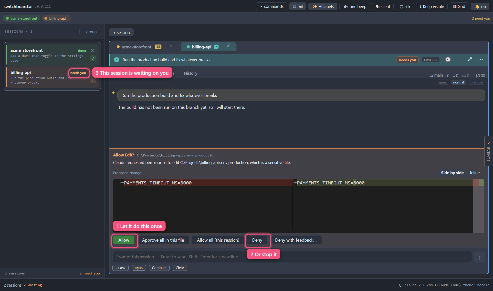

<a href="contents.md">☰ Contents</a>

# Approvals & autonomy

> Status: draft

When Claude wants to run a command or change a file, switchboard can ask you
right inside the session card — no window switching, no hunting for which
terminal is blinking.

## Answering a request

*A request waiting for you. The change it wants to make is shown before you answer.*

A review bar appears just above the prompt box: **Allow \<tool\>?**, with the
file or command it names, and underneath it **what the request would actually
do**:

- **A change to a file** — a **real diff**, the same one the Changes tab shows,
  with colour, syntax highlighting and the changed parts marked. This covers
  editing part of a file, writing a whole one, and making several changes to one
  file at once.
- **A shell command** — the command itself.
- **A change to a notebook** — the new contents of the cell, and which cell.
- **Anything else** — every setting in the request, listed one per line. You
  will see this for tools switchboard doesn't have a special layout for,
  including new ones added after your copy of switchboard was built. It's plain,
  but it's never blank.

### Reading the diff

The button on the right of the diff says **Side by side** or **Inline**, and
switches between them. It's the same choice as the one in the Changes tab and the
command palette — set it anywhere and it applies everywhere, because it's a habit
rather than a property of one request. On a narrow card two columns stop being
readable, so it shows the inline diff and the button's tooltip says that is why.

**Writing a whole file** shows everything as added, with a count of the lines.
That is deliberate rather than a limitation: switchboard is looking at the request,
not at your disk, so it does not know and will not guess what was there before. An
empty file still says so in words instead of showing you a blank box.

**Several changes to one file** are shown as separate changes in the order they
will be applied, each with a **change 2 of 5** line above it. Those lines are
switchboard's, not part of your file — they're drawn with a long dash so they can't
be mistaken for something Claude is proposing to write.

**The diff scrolls.** It's a band above the prompt box, not a full pane, so anything
past the first few lines is a scroll away rather than missing — use the wheel inside
it. It also gets shorter on a short window, so the prompt box and its buttons never
get pushed off the bottom of the screen.

**Nothing is quietly cut short any more.** A request used to be trimmed at about
1,500 characters with a **…** on the end. Now you get the whole thing, and in the
rare case that a request is genuinely enormous, a line under the diff says exactly
what is missing — how many lines, how many characters, how many changes. If there's
no such line, you're looking at all of it.

**If the diff can't load**, you get the older simple before-and-after boxes
instead, and the request is still answerable. That's on purpose: a body that fails
to draw must never cost you the ability to answer.

A shell command and the other one-sided requests keep the simple boxes, and are
still trimmed with a **…** if they're very long — there's no diff to show for a
command, and an editor would tell you less than the plain text does.

Five buttons:

- **Allow** — this one time.
- **Approve all in this file** — allow this change, and every later change this
  session makes **to that one file**, without asking again. It only appears when
  the request names a file: a shell command has nothing to scope it to.
- **Allow all (this session)** — stop asking for this session. It means it:
  from that click on, switchboard answers for you the moment Claude asks.
  Nothing appears on screen, nothing beeps, the taskbar doesn't flash, and no
  entry lands in the Events drawer. It also keeps working with the window
  minimised or closed — the answer is given inside switchboard, not by the part
  of it you can see. Resets when the session restarts.
- **Deny** — refuse. Claude is told you made the call deliberately, and that it
  should stop rather than look for another way round. It won't retry the same
  thing or reach for a different tool to get there anyway — it comes back and
  asks what you'd like instead.
- **Deny with feedback…** — refuse, *and say why*. A small box opens under the
  diff. Type your objection, press **Enter**, and your words go back to Claude
  along with the refusal.

### Taking a standing approval back

**Approve all in this file** and **Allow all (this session)** both set something
*standing* — the session stops asking, and from then on you see nothing at all:
no bar, no entry in the Events drawer, no sound. That is the point of them, and
it is also why they need a way back.

**The card's ⋯ menu has a STANDING APPROVALS section.** It is always there, and
it says "None — this session asks every time" when there is nothing in it. When
there is, each line is one approval with a **✕** beside it:

- **Everything (this session)** — the blanket one.
- One line per file, showing the end of the path. Hover, or use a screen reader,
  for the whole thing.

Take one back and the session asks about that file again, immediately. Taking
back the blanket approval leaves your per-file ones alone, and vice versa.

**A small dot on the ⋯ button** means something is standing. Worth knowing,
because a session under "Allow all" cannot ask you anything — so without the dot,
"it hasn't asked me about anything in a while" and "I told it not to" look
identical.

Standing approvals last as long as the *running session* does. Restart it, or
close and reopen the card, and it asks again from scratch. Nothing is saved to
disk.

### Saying why you said no

A bare **Deny** tells Claude that you decided against something. It doesn't tell
it what you'd rather have — so it stops and asks, and you end up typing the
explanation into the prompt box anyway.

**Deny with feedback** saves that round trip. "Wrong directory — that's
generated." "Don't touch the migration, do the model first." "Use the test
fixture, not the real config." Claude gets the refusal *and* the correction in
one go, and picks up from there.

- **Enter sends.** **Shift+Enter** starts a new line if you want more than a
  sentence. **Esc** closes the box and answers nothing — the request is still
  waiting for you.
- There's a limit of 500 characters. A counter appears as you approach it.
- Your text is attributed to you when Claude sees it, so an objection phrased as
  an instruction ("use the other file") reads as *you* saying it, not as
  switchboard making up rules.
- The plain **Deny** is unchanged and still one click. You never have to explain
  yourself.

The same **Deny…** button is on each held request in the Events drawer, so you
can refuse with a reason without opening the session at all. It is deliberately
*not* on the shared card when several sessions are asking the same thing: one
explanation can't honestly stand in for several different requests, so that card
offers plain Allow and Deny and leaves the explaining to each session's own card.

If several requests pile up, they queue: the bar shows **+2 more waiting** and
advances as you answer. The card surfaces its Session tab automatically when a
request arrives, even if you were looking at another tab.

**You can also answer without coming back at all.** If desktop pop-ups are on
and you're in another app, the pop-up for a permission request carries **Allow**
and **Deny** of its own, and it names what it would allow. Answering it here or
there is the same decision — whichever you use, the other goes away. See
[Notifications › Answering a permission from the pop-up
itself](09-notifications.md#answering-a-permission-from-the-pop-up-itself),
which also covers what each operating system can actually put on a pop-up.

## When Claude asks you a question

Sometimes Claude doesn't want permission — it wants an answer. "Which of these
three approaches should I take?", "which of these files did you mean?" When that
happens you get a panel in the same place as the review bar, just above the
prompt box, with the question written out and its answers as a list you can
click.

- **Round buttons mean pick one.** Clicking a different answer replaces your
  first choice.
- **Square boxes mean pick as many as you like.** Click each one you want;
  click again to un-pick.
- **There is always an "Other".** Tick it and a text box opens where you can
  type your own answer in your own words. Use it whenever none of the offered
  answers is right — Claude reads what you typed exactly as if it had offered it
  as an option, and it's the honest way to say "none of these, here's what I
  actually want".

### More than one question at a time

Claude can ask several questions in one go. When it does, they arrive as **tabs
across the top of the panel** — one question on screen at a time, with a tab for
each. The tab's name is Claude's own short label for that question ("Colour",
"Approach"), so you can see everything it asked without answering anything yet.

**Send answer** lights up as soon as **one** question has an answer — you do not
have to answer all of them. The panel makes sure you can always tell what state
you are in:

- **Each tab shows its own state.** A tick (✓) means that question is answered;
  an empty ring (○) means it isn't. It's the shape that tells you, not just the
  colour.
- **The panel says it in words too.** A line beside the button names the
  questions that are still empty — *"Still to answer: Languages"* while the
  button is greyed out, and *"Sending now skips: Languages"* once it isn't. No
  hunting through tabs to find the one you missed.
- **It opens where the work is.** The panel starts on the first unanswered
  question — including when you come back to it after looking at something else.

**The panel walks you through the questions.** When you pick an answer on a
round-button (pick one) question, the panel moves straight on to the next
question you **haven't answered yet** — one click per question. It skips over
ones you've already done, and wraps back round to an earlier one when there's
none left after it. It deliberately does *not* move when:

- you tick **Other** — you're about to type, so the text box stays put;
- you click an answer again to un-pick it — that question is open again;
- the question is a square-box (pick several) one — you might want more boxes;
- that was the last unanswered question — it stays where it is, and sending is
  up to you. It never presses **Send answer** for you.

To move on yourself — for example after ticking boxes — use **Next question**,
the first of the three buttons (**Next question**, **Send answer**, **Don't
answer**). It goes to the next unanswered question the same way, and it's greyed
out when every other question already has an answer. Either way, the keyboard
focus lands on the first answer of the question you've moved to.

### Answering only some of the questions

You can send an answer with questions still blank. It is a normal thing to do —
"I have an opinion about the first one and none about the second" — and Claude
handles it properly: the questions you left alone are reported to it as
**skipped**, not as answered with silence. In practice Claude notices the gap
and usually offers to ask that one again.

Because that's easy to do by accident with a question hidden behind a tab, the
panel makes the skipping obvious *before* you send:

- the tab of any unanswered question gains the word ***skipped*** after its
  name, and reads *"Languages — not answered, will be sent as skipped"* to a
  screen reader. It's a warning about what sending now would do, not an error —
  answer the question and the word goes away;
- the question itself, when you're looking at it, says **"Not answered — will be
  sent as skipped"** where its tick would go;
- the line beside the button changes to **"Sending now skips: Languages"**, and
  hovering **Send answer** says the same thing.

Nothing asks you to confirm and nothing nags — skipping a question is a real
answer. The panel's only job is to make sure you can see what you are choosing
not to say. (You do have to answer at least one; sending a completely blank
answer is what **Don't answer** is for.)

A single question — which is what you'll usually get — has no tabs and no
**Next question** button. It looks exactly as it always did.

**Don't answer** sends your refusal back. That's a real answer and a safe one:
Claude is told you declined, and it will usually just ask again in ordinary
conversation rather than getting stuck.

Take your time over it — **a question waits as long as you need.** Unlike a
permission request, which switchboard declines for you after five minutes, a
question has no time limit at all while switchboard is open: walk away, come
back tomorrow, and it is still there waiting. Your half-finished answer also
survives leaving the panel:
switch to **Changes** to look at the diff first, come back, and your ticks and
anything you typed are still there.

### Everything works from the keyboard

Tab into the list, **Up** and **Down** move between the answers of one question,
**Space** or **Enter** picks the one you're on (and on a pick-one question with
more to answer, moves you on to the next, just like a click). Tab moves on to
the buttons. If you're typing in an "Other" box, **Enter** is the same as
**Send answer**: it sends what you've answered so far, and any question still
blank goes back as skipped.

When there's more than one question, Tab also reaches the **tab strip**, and
there **Left** and **Right** move between the questions (**Home** and **End**
jump to the first and last). Moving to a tab opens it straight away — you can't
end up looking at a question you haven't actually selected. Up and Down stay
inside the question you're on and never wander into another one.

### Two things worth knowing

- **"Allow all (this session)" does not answer questions.** It's a standing yes
  to *tool use*, not a standing yes to *you*. Questions always wait for a real
  person, even in a session where you've turned everything else off.

## When several sessions ask the same thing

Run a few sessions on the same job and they tend to hit the same wall at the
same moment — all of them wanting to run `npm test`, all of them stopped.

When **two or more sessions are waiting on exactly the same request**,
switchboard puts it on one card just above the workspace instead of making you
visit each session in turn. The card says how many sessions are asking, what
they want to run, and lists them by name:

- **Allow in all N sessions** / **Deny in all N sessions** — one click, every
  session on the card answered.
- Each session also gets its own **Allow** and **Deny** next to its name, so
  you can say yes to one and no to another. Answering one leaves the rest
  exactly as they were: still waiting, still yours to decide.
- **No "Deny with feedback" here** — not on the group button, where one
  explanation would be sent to every session as if it were about each of them,
  and not on the individual rows either, which are one line tall and meant for
  quick triage. If you want to explain yourself to one session in particular,
  its own card is where to do it. A plain Deny from this card still tells each
  session you decided deliberately and that it should not go looking for a way
  round.

While a request is on the grouped card, it is not also shown in its own
session's review bar — one question, one place to answer it. Answer or decline
one session's copy and, if that leaves only one session still asking, the card
goes away and the last question returns to that session's own bar.

Things worth knowing:

- **"Exactly the same" means exactly.** Same tool, same arguments, character
  for character. `rm -rf build` and `rm -rf /` are not the same request and
  will never share a card. Two sessions editing "the same file" in two
  different project folders are asking about two different paths, so they get
  asked separately too. The bias is deliberate: being asked twice is a small
  annoyance, and one click approving something you did not read is not.
- **One card at a time.** If a second, different group forms while a card is
  up, those sessions keep asking in their own cards until the first card is
  answered. A session that joins the group *while it is on screen* is asking
  the identical question, so it simply joins the count.
- **There is no "allow all" on the grouped card.** Every button answers only
  the requests listed on it. Standing permission is still a per-session choice,
  from that session's own bar.

A request belongs to the session that asked it. If that session ends — you hit
**Restart**, you close a popped-out window and it suspends, or it exits on its
own — anything still waiting in its bar goes with it. There is nothing left to
answer, so switchboard drops the question rather than showing it to whatever
runs on the card next.

## Autonomy modes

Each session runs at one of four levels. Click the shield chip under the prompt
box to cycle it — **and hover it to read what the mode you are about to pick
actually does.** The same hover works on the shield chip in the title bar and on
the little mode marker in a card's header.

| Mode | What runs without asking you | What still stops for you |
|---|---|---|
| **ask** | Reading files inside the session's folder. | Everything else: file changes, shell commands, web fetches, and reading anything outside the folder. The safe default. |
| **plan** | Reading and exploring. | Claude writes you a plan and changes nothing until you approve it. Claude Code enforces that block itself. See [Approving a plan](#approving-a-plan). |
| **auto-edit** | File edits inside the session's folder. | Shell commands, web fetches, and reading anything outside the folder. |
| **full-auto** | Everything. | Almost nothing — see below. |

Changing the mode applies **the next time the session starts or resumes** —
Claude Code can't switch modes mid-flight. The chip in the title bar sets the
mode that *new* sessions start at; each session keeps its own after that.

### Approving a plan

A session in **plan** mode reads, thinks, and then asks you whether to go ahead
with the plan it wrote. That question arrives as an approval bar,
like any other — it reads **Allow ExitPlanMode?** (Claude Code's own name for
"leave plan mode"), with the plan underneath.

- **Allow approves the plan, and the session leaves plan mode.** From then on it
  behaves as an **ask** session does: it starts the work, and each file change
  or command comes to you as its own approval. Approving the plan is not
  approving the edits.
- **Allow all (this session) approves the plan *and* everything after it.** The
  button means here what it means on any bar: you will not be asked again until
  this session next starts. On a plan, that is the plan and every change that
  follows from it.
- **Deny keeps it in plan mode.** Nothing is changed. Claude tells you it was
  turned down, and you can say what you want different — **Deny with
  feedback…** puts your reason in front of it.
- **While it is planning, you are not asked about commands or edits**, because
  it does not attempt any. It can still ask you a *question*, the way any
  session can.
- **The mode chip still says plan afterwards.** The chip shows the mode the
  session is *started* in, and that has not changed; it does not follow the
  session out of plan mode.

One thing to know: the bar shows the plan on a single line, so a long plan is
hard to read there. That is a known rough edge.

### What full-auto really is

**full-auto is not a gentler version of "skip the prompts" — it is that.** It
starts Claude Code in its `bypassPermissions` mode, which is the same mode the
`--dangerously-skip-permissions` flag turns on. Every tool call runs the moment
Claude asks for it, including writes *outside* the session's folder and into
files a normal mode would never touch unasked. It is not a sandbox: nothing is
containing what a command can reach, only whether you were asked first.

A short list of things still hold, and they are all Claude Code's, not
switchboard's:

- **`deny` rules in your `settings.json`** block in every mode, this one
  included. (`allow` rules stop meaning anything, because nothing is being
  asked.)
- **Explicit `ask` rules** you have written still prompt.
- **Things that need an actual person** — a question Claude asks you, and an
  MCP tool marked as needing a human — still wait for you.
- **`rm` aimed at a critical path** still prompts.

That is the whole list. Use full-auto where you would be happy to hand someone
else the keyboard for the length of the task.

### What decides when you get asked

**Claude Code does, and only Claude Code.** You are asked exactly what you would
be asked running `claude` yourself in that folder on that mode — no more, no
less. Switchboard chooses the mode and then presents the questions Claude Code
decides to ask; it does not keep a list of its own.

> **⚠️ This changed, and it changed in the direction of FEWER prompts.**
> Switchboard used to keep its own table of which tools to stop for, because of
> how the old approval mechanism worked — it saw every tool call and had to
> decide for itself which ones deserved a person. That table was deliberately
> *stricter* than Claude Code:
>
> - Under **auto-edit** it brought **every** shell command to you, including the
>   in-folder housekeeping Claude Code's own accept-edits mode waves through —
>   `mkdir`, `touch`, `mv`, `cp`, `rm`, `sed`. **You will no longer be asked
>   about those.**
> - Under **ask** and **auto-edit** it also asked before Claude read a file
>   *outside* the session's folder. **That is now Claude Code's call too.**
>
> The old note here said being asked when you expected not to be is a small
> surprise and the other way round is not — which is still true, and is why this
> is called out rather than quietly dropped. If **auto-edit** felt right to you
> partly because switchboard was adding that extra layer, **use ask instead**:
> it stops for every tool call, and it is the mode that has not changed.
>
> Why it changed: the extra layer rode on a mechanism that also had a hole in it
> — it could not answer some questions at all, and Claude Code asked you a second
> time in the terminal when it tried. Removing the terminal removed both halves.
> See [Direct mode](12-direct-mode.md).

## Good to know

- **Plan mode asks you to approve the plan, and your answer counts.** A plan
  session changes nothing while it is planning — Claude Code enforces that
  itself, and no approval is asked for because no change is attempted. What it
  does ask is whether to go ahead with the plan, and **Allow on that bar is what
  ends the read-only part**: the session leaves plan mode and starts the work,
  asking about each change as it goes. See [Approving a plan](#approving-a-plan).
  (Earlier versions of this page said plan mode never asks in the app, and then
  that it stays read-only whatever you click. Neither was right.)
- **Nothing is ever auto-approved by switchboard.** The only thing that answers
  *allow* without showing you the question is **Allow all (this session)**, and
  that is you having answered it in advance. Everything else, if it can't reach
  you, is handled by one of the two rules below — and neither of them says yes.
- **switchboard names the mode; it never leaves it to chance.** Each of the four
  modes maps to one of Claude Code's own permission modes, and switchboard says
  which one every time it starts a session. That matters most for **ask**: it
  used to say nothing and let Claude Code choose, and recent versions changed
  what Claude Code chooses — on a Pro, Max or Team plan a session that specifies
  nothing now starts in **auto** mode, where a second model reviews each action
  instead of you. An **ask** session is now told to stop for *you*, which is
  what the name always promised. The reviewing model is Claude Code's own
  control (**Shift+Tab** inside its interface), and switchboard has no way to
  reach it now that sessions run without a terminal — if you want it, run
  `claude` yourself in the project folder.
- **If switchboard can't reach you, it stops asking.** When does that happen?
  On **macOS**, closing the window leaves your sessions running in the
  background. On any platform, switchboard's display can crash while the
  sessions underneath it keep running. (On **Windows and Linux** closing the
  window quits switchboard, so only the crash case applies.) There is also a
  **five-minute limit** on any single request: one left unanswered that long
  counts as unreachable too. (A *question* — the kind with clickable answers —
  has no time limit at all; it waits for you. See [When Claude asks you a
  question](#when-claude-asks-you-a-question).)

  There is no terminal prompt behind it: Claude Code is waiting on switchboard
  and on nothing else, so leaving the question unanswered would leave the
  session stuck for ever. Switchboard **declines** it instead, and tells Claude
  plainly that nobody was available rather than that it was blocked — so it
  stops and asks again rather than hunting for a way round. You'll see it come
  back as a normal request the next time you're there. If you want a session to
  keep going while you're away, turn on **Allow all (this session)** before you
  leave.
- **A question can't outlive the session that asked it.** If a session dies
  while an approval is on screen, the question dies with it — nothing is left
  waiting on an answer that can no longer go anywhere. Starting the card again
  clears the bar and begins fresh.
- **full-auto** is shown in red as a reminder.
- **The hover is the short version of this page.** Every mode control carries a
  description of what the mode does; if you only ever read one thing about
  autonomy, read the one on **full-auto**.

---

[← Back to Contents](contents.md)
