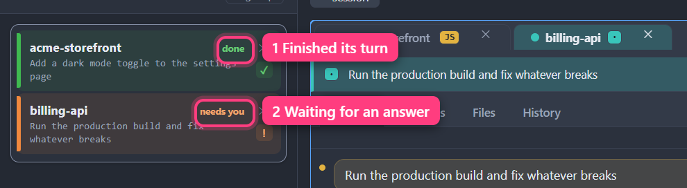

<a href="contents.md">☰ Contents</a>

# Organizing your workspace

> Status: draft

## The Sessions list

*Each row says what its session is doing.*

Down the left edge: every session you have, sorted into groups. It's built to
answer two questions without you having to read it properly — *what group is
this session in*, and *which sessions are waiting on me*.

Each session is one row: a colored bar down its left edge (that stripe is the
session's identity — the same color follows it onto its card), its name, and
underneath, whatever it's currently doing. On the right of the row, a **✕** to
close it and a small indicator of its state:

| You see | It means |
|---|---|
| a spinning ring (or bouncing bars), and the whole row marked as busy | working, or still starting up — nothing needed from you. How a busy row is marked is your choice: see [How a working session looks](10-settings.md#how-a-working-session-looks) |
| **?** | it asked you a question |
| **!** | it wants permission to do something |
| **✓** | it finished, and you haven't looked yet |
| **–** | idle |
| **✕** | it crashed |

**When a session needs you, the row says so in words.** It tints itself in the
status color, thickens its edge bar, bolds the name, and replaces the "what
it's doing" line with the actual ask — *Asked you a question*, *Wants
permission to run*, *Finished — review changes*, *Crashed — needs restart*.
Calm sessions stay plain and quiet. That contrast is the whole point: you
should be able to spot the ones that need you from across the room.

Each group header counts its own waiting sessions (**"2 need you"**, or
**"calm"** when none are), and the bar at the bottom of the list totals them
for the whole workspace. When nobody is waiting, there is no total there at
all. Those counts count exactly what the [Events
drawer](09-notifications.md#the-events-drawer) is listing, so dismissing an
entry there drops them straight away.

A row with a **dashed** edge is a session that is folded away: collapsed or
hidden, still running, but not in the workspace. Click it and it comes back to
where it was. See [Getting a session out of the way](#getting-a-session-out-of-the-way).

Click a row to jump to that session. Double-click to rename it — `Esc`, or Enter
on an empty box, leaves the name alone. Right-click for
**Open changes**, **Rename**, **Pin session**, **Close session**, and
[what this session does when you submit a prompt](#changing-it).

A **pinned** session (📌) sorts to the top of the list — of its group, if it is
in one — stays put at the top while the rest of the list scrolls underneath it,
and is skipped by everything that acts on sessions in bulk. See
[Pinning a session](02-sessions.md#pinning-a-session-you-always-want-to-find).

Sessions that are suspended or not currently on screen still appear here — the
list is the complete inventory. That includes a card whose session
[didn't start](11-troubleshooting.md#sessions): it shows as *not started*, and
**Rename** and **Move to group** are the only two things it can't do.

At the top of the list are **+ group**, which makes a new group, and
**+ session**, which opens a new session: you pick a folder and its card
appears in the workspace. `Ctrl+N` does the same whenever you are not typing
in a prompt box. While the list is hidden there is no **+ session** button on
screen: bring the list back, or use `Ctrl+N` or **▸ commands ▸ New session…**.

**Resize it** by dragging the right edge of the list. The width is remembered.
To hide it entirely, press `Ctrl+B`, or click **◧ left** in the bar along the
top of the window while it is lit. Click it again to bring the list back.

### Seeing what a session was last asked

Rest the pointer on a session for about half a second and a small box appears
with the **last prompt** you sent it, so you can tell what it is doing without
switching to it. It works in three places:

- a session's row in the Sessions list,
- its pill (or its row in a group's list) when the sessions are across the top,
- its tab above the card.

The box shows the first few lines of the prompt; a long one ends in "…". It
never gets in the way: it does not take clicks, and it goes away as soon as
you move off, click, press a key, scroll or start dragging.

- A session that is running but has not been asked anything says **No prompts
  yet**.
- If your last message was only a picture or a file, it says **An attachment,
  with no text**.
- A session that is **not running** (it never started, or it has stopped)
  shows nothing. Start or resume it and the box works again.
- Sessions in a popped-out window do not show the box on their tabs.

### When nothing is open

With no session and no document open, the middle of the window says **No
sessions open** and has one button, **Start a session**. It does exactly what
**+ session** in the Sessions list does: you pick a folder and the session
opens.

It is there whether the Sessions list is showing or hidden, so a window with
the list hidden is never blank. It goes as soon as anything is open, and it
comes back when you close the last thing. A workspace that holds only a
document or a diff is not empty, and does not show it.

### The ⋯ menu on a small card

Each session's card has a **⋯** menu at the top right. When the card is short
(several sessions stacked in rows, or a small window) there may be no room for
the menu under its button. It then opens **above** the button instead, and if
the window is too short for it either way, the menu scrolls. Every entry is
always reachable, and the menu never covers the **⋯** you opened it from.

### Listing sessions across the top instead

The list does not have to live on the left. Next to **▸ commands** in the bar
along the top of the window there is a two-part button, **◧ left** and
**⬒ top**. The lit half is where your sessions are listed.

- Click **⬒ top** and the list on the left goes away. In its place is one
  strip under the top bar, and your sessions get the whole width of the window.
- Click **◧ left** to go back.
- Click whichever half is **lit** to put the list away altogether. Neither half
  is lit while it is away. Click either half to bring it back there, or press
  `Ctrl+B` to bring it back where it was. While it is away nothing lists your
  sessions, and nothing in the main area says **N need you**. The status bar
  at the very bottom still shows how many are waiting, the Events drawer still
  lists what needs you, and `Ctrl+1` to `Ctrl+9` and `Ctrl+Space` still work.

The same choice is in **Settings** (`Ctrl+,`) under **Appearance ▸ Sessions
list**, as two pictures: **On the left** and **Across the top**. It takes
effect the moment you pick one, and it is remembered when you restart.

Along the top of the strip, in this order:

- **+ group** makes a new group, exactly as it does in the list on the left.
- **+ session** opens a new session. It is the only "+ session" button there is.
- **N need you** appears beside them when any session is waiting on you, and
  is the same number the list on the left shows at its foot.

Under those, your **groups**, in the same order as the list on the left: the
ones you made first, then any [automatic groups](#automatic-groups). Each
group is one box:

- a **coloured dot** (an automatic group has a **folder** instead, and the
  word **auto** after its name),
- a small number or range such as **1–4**: the `Ctrl+1` to `Ctrl+9` shortcuts
  that reach the sessions inside it. The counting is the same as with the list
  on the left, so a shortcut goes to the same session either way,
- the group's name,
- how many sessions it holds,
- underneath, **N need you**, or **calm**, or **empty**,
- **⊕** to open a new session in that group (not on automatic groups),
- a tinted **▾** at the end.

**Click a group** and a list of its sessions drops down. They are the same
rows as in the list on the left: name, a word for what the session is doing,
what it is working on, the status mark and **✕** to close it, plus the
shortcut number. When a group says **2 need you**, exactly two rows in its
list are highlighted. Click a row to go to that session; the list closes.
Click the group again, click anywhere else, or press `Esc` to close the list
without going anywhere. A double-click does not rename a row here, as it does
in the list on the left: the first click already goes to the session. Use
**Rename…** on the right-click menu instead.

After the groups come the sessions that are **not in a group**, each as a
two-line pill: its name and a word for what it is doing, what it is working
on underneath, the status mark at the end, and its colour as a bar down the
left edge. A pill looks the way that session's row does in the list on the
left, in every state: a session that needs you is filled in and bold. Click a
pill to go to that session.

A pill with a **dashed** edge is a session that is folded away: collapsed or
hidden, still running, but not in the workspace. Click it and it comes back.
Each folded-away session keeps its own pill.
A folded-away session that is **in a group** has no pill; its group says
**· 2 folded away**, and its row in the group's list has the same dashed edge.
Click the row to bring it back.

A pinned session comes first among the pills and shows a 📌. A session that
another session started sits straight after it, with a small **↳**. A number
in a small bubble means that many messages from other sessions are waiting in
it; on a group the same thing reads **· 3 waiting**. Waiting messages are
separate from **need you** and are not counted in it.

**A group tells you when something inside it is working**, without your having
to open it. Where it would say **calm** it says **2 working**, it gets a
spinner, and the whole box is marked the way a working session is, in the
group's own colour. Which way that is, is your choice:
[How a working session looks](10-settings.md#how-a-working-session-looks).
If any session in the group needs you, the group says that instead, in yellow,
and is not marked as working: needing you always wins.

**When there are too many to fit**, the strip scrolls sideways: use the mouse
wheel over it, or the cell that appears at each end. A cell turns **amber and
shows a number** when that many sessions that need you are off that end; it
is plain when sessions are cut off but none is waiting. Click a cell to scroll
that way. The **N need you** total above never scrolls.

#### Right-click menus on the strip

There are no menu buttons on the strip. **Right-click** the thing you want to
change. (From the keyboard: move to it with `Tab`, then press `Shift+F10`.)

**On a session** (its pill, or its row in an open list). This is the same menu
you get by right-clicking a session in the list on the left:

- **Open changes** shows what that session has changed.
- **Rename…** puts a box where the name was. `Enter` keeps the new name;
  `Esc`, or clicking away, leaves the old one. An empty name is ignored.
- **Pin session** / **Unpin session**.
- **Close session** asks first, exactly as the ✕ does.
- **Move to group** lists your groups, with a tick on the one the session is
  in now, and **No group**. Pick one to move it. (Not there if you have no
  groups yet, or for a session that never started.)

What one session does when you send a prompt, and when it needs you, is not on
this menu. Those two are on the session's own card, in its **⋯** menu: see
[Getting out of the way by itself](#getting-out-of-the-way-by-itself).

**On a group:**

- **New session in this group** — the same as its ⊕.
- **Open all in the workspace** brings back every session in the group that
  is folded away, one after another; you end up on the last one. It is greyed
  out when none is folded away, and it leaves the others where they are.
- **Rename group…** works like renaming a session.
- **Change colour** steps to the next colour.
- **How its sessions are shown: …** says what happens to this group's
  sessions when you send a prompt, and steps to the next choice each time you
  pick it. See [Getting out of the way by itself](#getting-out-of-the-way-by-itself).
- **Delete group** removes the group. Its sessions are not closed; they are
  simply no longer in a group.

An automatic group only has **Open all in the workspace**: it is a folder the
app noticed, so there is nothing of it to rename, recolour or delete.

**On an empty part of the strip** (including the line with **+ group** and
**+ session**): **Sessions on the left** / **Sessions across the top**, with a
tick on the one in use, then **+ New group** and **+ New session**.

None of the menus has "Move up" or "Move down". Order is by dragging, or
from the keyboard: see the end of the next section.

#### Dragging on the strip

- **Drag a group sideways** to put it somewhere else among your groups. A
  line shows where it will land. Only groups you made move; automatic groups
  stay after yours.
- **Drag a pill sideways** to put that session somewhere else among the
  pills. A pinned session stays in front: a pill dropped ahead of it lands
  just after it. A session that another session started moves with the one
  that started it.
- **Drag a session up or down inside its group.** Open the group's list and
  drag a row over another row: the top half of a row means "above it", the
  bottom half "below it", and a line shows where it will land. The list
  stays open while you do it, so you can move several. A pinned session
  stays first.
- **Drag a row from an open list onto another group** to move the session
  to that group. (If the group you want is off the end of the strip and you
  hold the row over the end cell to scroll to it, the list closes; keep
  holding, and drop on the group when it comes into view.)
- **Drag a pill onto a group** to put the session in that group. The group's
  edge lights up while you hold it there. Automatic groups do not take a
  session this way, and do not light up. You can drag a session's tab up from
  the workspace onto a group, too.

The line and the lit edge only appear where letting go would really change
something. If neither shows, a drop there does nothing.

When the place you want is off the end of the strip, hold what you are
dragging over the cell at that end and the strip scrolls along.

The order is the same one the list on the left uses. Put your groups in an
order here and that is their order there, and `Ctrl+1` to `Ctrl+9` follow it.

To take a session **out** of a group altogether, use **Move to group ▸ No
group** on its right-click menu. (A row can be dragged within its list and
onto another group, but there is nowhere on the strip to drop it that means
"no group".)

**Without the mouse:** `Ctrl+Alt+↑` and `Ctrl+Alt+↓` move the session you are
in earlier or later, as they do with the list on the left. To move a group,
`Tab` to it on the strip and press `Ctrl+Alt+←` or `Ctrl+Alt+→`.

When you press `Ctrl+Space` to go to the next session that needs you, its pill
is outlined for a moment, and the strip scrolls so you can see it. For a
session in a group, the group is outlined; if that group's list is open it
stays open and the session's row is outlined too.

## Groups

Groups are folders for sessions, and they stay put even when empty. Each one is
a card with its own color and a **colored dot** beside its name.

- **Make one:** click **+ group**.
- **Rename:** double-click its name. The same rules as a session's name: `Esc`
  leaves it alone, and so does pressing Enter on an empty box — a group always
  has a name, so clearing it counts as "never mind" rather than as a new, blank
  one. Spaces at either end are trimmed off.
- **Recolor:** click its colored dot to cycle through the palette.
- **Collapse:** click the header.
- **Add sessions:** drag a session row **anywhere onto the group card** — the
  header, a session already in it, or the empty space inside. The card lights
  up in the group's color to show where the session will land. Its window moves
  to sit alongside its new siblings. **The session joins at the bottom of the
  group**, whichever way you moved it there (dragging, the menu, or the
  keyboard); drag it up from there if you want it higher. A pinned session is
  the one exception: it goes to the front, with the other pinned ones.
- **Remove a session:** drag it onto empty space in the list, outside any group.
- **Without dragging:** right-click a session row (or press `Shift+F10` on it)
  and pick a group under **Move to group** — the same list, plus **No group**
  to take it out. See
  [Moving a session into a group without dragging](06-keyboard.md#moving-a-session-into-a-group-without-dragging).
- **Start a session directly inside one:** click the **⊕** on the group header.
- **Set what its sessions do on submit:** the **⬍** on the group header —
  see [Getting out of the way by itself](#getting-out-of-the-way-by-itself).
- **Delete:** the **✕** on the header. The sessions inside are kept — they just
  become ungrouped.
- **Change the order of your groups:** right-click a group's header and choose
  **Move group up** or **Move group down**. Or drag the group by its header:
  a line appears between two groups to show where it will land, above or below
  the one you are over. A folded group moves the same way as an open one. The
  order is remembered when you restart, and the sessions inside a group are not
  touched by moving it. From the keyboard, Tab to the group's name and press the
  Menu key (or Shift+F10) for the same two choices.

  Only groups you made can be moved. [Automatic groups](#automatic-groups) and
  **Ungrouped** always sit below them.

## Automatic groups

Sessions in the same repository or folder also cluster on their own, with no
setup. These look deliberately different from the groups you make: a **solid
folder icon**, a tinted card, and the word **AUTO** in the header. No dot, and
no **⊕** or **✕** — there's nothing to configure.

**You can't drag a session into an automatic group,** and it will show you a
"no drop" cursor if you try. That isn't a bug: membership is worked out from
where the session's folder is, so there's nothing a drop could change. To move
a session, drop it on one of *your* groups, or on empty space to ungroup it.

An automatic group disappears on its own when it's down to one session, and
putting a session into a real group always wins over the automatic clustering.

Anything else collects in **Ungrouped** at the bottom — no icon, because it's
an absence rather than a thing. You *can* drop onto it, which ungroups.

(If you haven't made any groups at all, there's no heading anywhere — the
sessions are simply the list.)

## Pop-out windows

Click **⤢** in a card header to tear that session into its own window — useful
for a second monitor. The session keeps running throughout; nothing restarts.

- Click **⤡** to dock it back into the main window. It goes back to the spot it
  came from — the space it left is held open while it is away — so a session you
  pop out and put back does not shuffle your layout around. If you had put that
  session in a **group**, it is still in that group when it comes back.
- **Closing the pop-out window** instead *suspends* the session: the card
  returns to the main window with a **Resume** button, and the conversation is
  kept. It still comes back to its own spot — closing the window changes whether
  the session keeps running, not where its card ends up.
- **Changes and file viewers always open in the main window**, even when the
  session they belong to is off in a pop-out. They're things you read next to
  your work, so they go where you asked from rather than stacking up as extra
  tabs on the second monitor.
- **Click ＋ to start a new session in the pop-out itself.** It sits next to ⤢
  in the card header and only appears once the card is out in its own window —
  the main window already has **+ session** in its sidebar. The new session
  arrives as a tab right beside the one you asked from, on the same monitor, and
  the folder picker opens over that window rather than yanking the main window
  in front of you. `Ctrl+N` (`Cmd+N` on a Mac) does the same thing when you
  press it in a pop-out.

  The new session is an ordinary one in every other way: it gets a row in the
  Sessions list, it can ask for your attention, and **⤡** docks it back into
  the main window on its own — it isn't tied to the window it started in. It has
  never had a spot on the grid, so it comes home the way a *new* session does:
  beside the sessions already there, never on top of a document, and never into
  the spot belonging to the session whose window it was started in — however the
  window empties, including when you close it from the title bar or the taskbar,
  and including when the session that opened it has already gone.
- **A new session always opens somewhere you can see it.** Started from the main
  window, it opens there: at full size in the space a popped-out session left
  behind rather than in the sliver that space collapses to, and never on top of
  a document you have open. Started from a pop-out, it opens in that pop-out.
  Either way it lands where you were looking, not tucked into a seam.
- **However** the window goes — the ⤡ button, its own **X**, the task bar, Task
  Manager, or a crash — the card comes back to the main window the same way. A
  window that dies without warning can take a few seconds to be noticed; the
  card then arrives suspended, with the same **Resume** button, and nothing is
  lost in the meantime.

Window positions are remembered. If a monitor is missing at startup,
switchboard rescues any windows that were on it rather than losing them
off-screen — and when that monitor comes back, Events offers a one-click
**Restore** to put the layout back the way it was. It never moves your
pop-outs without asking.

The main switchboard window is the one exception, and it works the way you'd
expect from any other app: when your monitors go to sleep and wake up, it
returns to the monitor it was on by itself, rather than piling onto your main
display with everything else. It remembers a position for each monitor setup
you use, so moving between a desk and a laptop on its own keeps both. It only
ever goes back to a monitor it has already been on — plug in a projector and
the window stays where it is.

If you use a screen reader, you don't have to keep checking Events for that
offer: a monitor coming back is something the app notices, not you, so the
offer reads itself out as soon as it appears. It waits for a pause rather than
interrupting — nothing has moved, and the offer keeps standing until you
answer it.

## Getting a session out of the way

A session you're not watching right now doesn't have to take up space. Every
session sits on a **ladder** with four rungs, and you can move it down a rung at
a time as it needs less of your attention — and back up again in one click.

| Rung | What you see | Space it takes |
|---|---|---|
| **Expanded** | the full card, where you put it | its own spot in the grid |
| **Collapsed** | no card — its row or pill in the Sessions list, with a dashed edge | none at all |
| **Tabbed** | stacked as a tab with the other tabbed sessions | shares one spot |
| **Hidden** | no card — its row or pill in the Sessions list, with a dashed edge | none at all |

**None of these stops anything.** At every rung the session keeps working, its
conversation is untouched, and it stays in the Sessions list with its status
indicator. Only the card changes. Closing a session is a completely
separate thing — it's the **✕**, and it asks first.

**Collapsed and hidden look the same in the list.** Both are *folded away*:
the card is out of the workspace, and the session's row or pill gets a dashed
edge. They are still two rungs, so `Ctrl+Shift+↓` and `Ctrl+Shift+↑` still
step through both, but nothing in the list tells them apart.

### Moving up and down

- **Down a rung:** `Ctrl+Shift+↓`, or the **▁** button in the card's header
  (which collapses it straight away).
- **Up a rung:** `Ctrl+Shift+↑`.
- **Straight to a rung:** open the command palette (`Ctrl+Shift+P`) and run
  **Collapse session**, **Stack session with the tabbed sessions**,
  **Expand session to its full card**, or **Hide session (keeps it running)**.

The two shortcuts act on the session you're currently *in*, so they work from
the **Expanded** and **Tabbed** rungs — the two where the session still has a
card to be focused. Once a session is collapsed or hidden it isn't focused any
more, so bring it back with a click on its row or pill in the Sessions list
and carry on from there. Nothing becomes
unreachable: the palette can put any focused session on any rung by name.

**Coming back up always lands somewhere you can see.** A session takes its old
spot when that spot is still there, and a spot left empty by a neighbour popping
out counts — it opens back up to full size rather than the sliver it collapses
to while nobody is in it. If the spot has become something else in the meantime
— a document you have open, or a pane that has moved into its own window — the
session gets a fresh spot instead, next to the others.

A folded-away session is marked in the Sessions list with a **dashed** edge on
its row or pill, which still shows the session's color, its name and what it's
doing. Click it to bring that session straight back. Each folded-away session
keeps its own row or pill, however many there are. With the list across the
top, a group also says how many of its sessions are folded away, such as
**· 2 folded away**.

### Coming back

Click a session and it returns: its row or pill in
[the Sessions list](09-notifications.md#who-needs-you-in-the-sessions-list),
or its entry in
Events. It comes back to the **exact spot it left** — the same position among
its neighbours, on the same view tab you had open, and if it was in its own
window, back into one. If the layout around it has changed enough that its old
spot no longer exists, it comes back into the main grid rather than nowhere.

**A session that needs you comes back on its own.** If it asks permission, asks
a question, or finishes while it's collapsed, tabbed or hidden, its card
reappears in its old spot without you doing anything.

It reappears *without stealing your place*. Whatever you were typing in stays
focused — the returning card waits for you rather than grabbing the screen. Its
highlighted row in the Sessions list and the Events list are what tell you it's
waiting. (If you'd rather it
*did* jump you straight there — or rather it didn't reappear at all — that's a
setting: see [When a session interrupts you](#when-a-session-interrupts-you).)

Where a session sits on the ladder is remembered across restarts: sessions come
back collapsed, tabbed or hidden exactly as you left them. One thing
deliberately doesn't carry over — sessions that were *already* waiting on you
when you quit stay where you put them at the next launch, instead of the
workspace unfolding itself the moment it opens.

## Arranging the whole workspace

Moving one session down a rung is a decision about that session. A **layout
mode** is a decision about all of them at once — one setting that says what the
workspace should look like, and then puts every session where it belongs.

| Layout | What you get |
|---|---|
| **Grid** | every session gets its own card *(default)* |
| **Focus** | one big card — the session you're in — and everything else folded away, shown with a dashed edge in the Sessions list |
| **Queue** | only the sessions that need you get a card; the rest are folded away the same way |

Nothing is closed and nothing stops: a layout mode only moves sessions up and
down the same four-rung ladder described above, so everything is still in the
Sessions list, still running, and still one click from coming back.

**Grid is the default, and it's the only one that leaves you alone.** Switch to
Grid and every session gets a card back — but after that it stops interfering,
so a session you collapse by hand stays collapsed. Focus and Queue are the two
that keep arranging as things change.

**Focus follows you.** The big card is whichever session you're in, so clicking
another session in the Sessions list
hands the space to that one and folds the one you left. It's a composition of
the same rungs, not a special full-screen mode, so everything else in this page
keeps working exactly as it does in Grid.

**Queue is inbox-zero for agents.** Only the sessions actually waiting on you
keep a card, so with seven or eight agents running you're looking at your to-do
list rather than a wall of tiles. A session's card appears the moment it asks
permission, asks a question, or finishes — and folds away again once you've dealt
with it and moved on.

### Changing it

- **From the keyboard:** `Ctrl+Shift+L` cycles Grid → Focus → Queue.
- **With the mouse:** while Focus or Queue is on (or a session is maximized),
  a **▦** chip in the title bar says so. Click it to step to the next one;
  it goes away when you are back on Grid. In the ordinary Grid layout there
  is no chip: its spot has the
  [arrangement buttons](#arranging-cards-with-one-click) instead.
- **By name:** the command palette (`Ctrl+Shift+P`) has **Layout: Grid**,
  **Layout: Focus** and **Layout: Queue**, so you can go straight to one.

The mode is remembered across restarts, and the workspace comes back arranged
the way you left it.

### What a layout won't do

Three kinds of session are never folded away, whatever the mode:

- **A session that needs you.** If it's holding a permission, has asked a
  question or has finished and you haven't looked yet, it keeps its card. This is
  the same promise the rest of this page makes — a session that needs you always
  comes back — and a layout mode isn't allowed to break it.
- **The session you're in.** Even in Queue, the card you're actually looking at
  stays. The workspace never empties out from under you.
- **A session you've popped out into its own window.** Putting a session on a
  second monitor is a stronger statement than a layout setting, and folding it
  would close that window.

A session you've already collapsed, tabbed or hidden by hand is also left where
you put it — it's out of the way already, and a mode won't drag it half-way back.

### Maximize

Sometimes you just want one session, right now, without changing the mode.
**Double-click a session's header** and it fills the workspace; everything else
is folded away. Double-click again — or press `Ctrl+Shift+M` —
and the workspace goes back as it was, including anything you'd hidden by hand
before you maximized. Sessions you've *brought back since* are left where you
put them: undoing a maximize puts back the parts of the arrangement you haven't
changed, rather than overwriting newer decisions with older ones.

Picking a layout mode while a session is maximized ends the maximize: you've
just asked for a whole arrangement, so that's the one you get. And a maximize
isn't a trap — clicking another session while one is maximized brings that one
back as usual; the rest stay folded until you undo it. A maximize only
rearranges the workspace at the moment you take it and the moment you undo it,
and never folds anything later on its own — so in the **Grid** layout, a session
you went to look at stays when you click away from it again. In **Focus** and
**Queue**, the layout's own rule keeps working while a session is maximized:
Focus folds the card you leave (the maximized one included), and Queue keeps
bringing out sessions that need you.

A maximize you left on a long time ago can't ambush you. If the session you
maximized is no longer filling the workspace — you collapsed, tabbed or hid it
at some point since — then double-clicking its header means what you'd expect,
"maximize this", and not "put back whatever the workspace looked like the day I
took this". And when you *do* undo one, sessions you've **re-opened** since, or
pushed **further out of the way**, stay where you put them, and sessions created
since are left alone. (A session you simply collapsed by hand does come back —
from the outside that looks exactly like one the maximize folded, and guessing
wrong there would be the worse mistake.)

This works on a **suspended** session too (one that came back with the app and
hasn't been resumed yet). Its card keeps a header — the session's name, its
colour and badge, and the word *suspended* — so there's something to
double-click, and `Ctrl+Shift+M` does the same thing from the keyboard.
Maximizing a suspended session doesn't wake it up: it stays suspended, with its
**Resume** button, until you press that.

## Getting out of the way by itself

Most of the time you don't move a session down the ladder because you decided
to — you move it because you just gave it something to do and you're going to
go look at something else. So switchboard can do that part for you, if you ask
it to.

**Out of the box it doesn't.** Send a prompt and the card stays exactly where it
is, so you can watch the turn come in. Turn one of the other two settings on and
sending a prompt gets that card out of your way by itself:

| Setting | When you submit a prompt |
|---|---|
| **Keep visible** | nothing happens — the card stays exactly where it is *(default)* |
| **Collapse on submit** | the card is folded away; its row or pill in the Sessions list gets a dashed edge |
| **Hide on submit** | the card leaves the workspace entirely |

With either of those on, the session keeps running and **its card comes straight
back to the spot it left** when it finishes, asks a question, or asks permission
— the same reappearance described under *Coming back* above.

**Collapse on submit** and **Hide on submit** both hand the space to the
sessions you're still looking at. Either way the session leaves the workspace
and lives only in the Sessions list, with a dashed edge, and in Events — until
it needs you, at which point it comes back like everything else. The two look
the same in the list; they differ only in which rung the session is on, so
`Ctrl+Shift+↑` and `Ctrl+Shift+↓` step from a different place. It suits
running six or seven agents at once.
**Keep visible** is the default because watching your first prompt actually run
matters more than the space it takes.

### Changing it

- **For everything:** the **⬍** chip in the title bar. Click it to cycle through
  the three; the label always says which one you're on.
- **For one session:** open the **⋯** menu at the top right of that session's
  card. **On submit** is a drop-down there with all three, plus **Follow the
  default** — which is how you go back to whatever the global setting is,
  including after you change it later. It shows the choice in force. (This
  used to be on the right-click menu of the session's row in the list on the
  left.) If the card is folded away, click the session in the list first.
- **For a group:** the **⬍** button on the group header cycles that group's
  setting. It's dimmed while the group is just following the default. (Only on
  groups *you* made — [automatic groups](#automatic-groups) have nothing to
  configure, which is why they have no buttons at all.)
- **From the keyboard:** the command palette (`Ctrl+Shift+P`) has all of them,
  at all three levels — search for *on submit*. (The group entries act on
  whichever session you're currently in, so they still work with the Sessions
  list hidden.)

The most specific setting wins: a session's own choice beats its group's, which
beats the global one. All of it is remembered across restarts.

### What it won't do

- **It won't touch a session you've popped out into its own window.** Putting a
  session on a second monitor is a stronger statement than a global default, and
  closing that window on every prompt would be obnoxious. Collapse it by hand if
  you want to.
- **It won't push a session further down than it already is.** If a session is
  already collapsed, submitting from it doesn't then hide it.
- **It won't move a session that's waiting on you.** If a session is holding a
  permission or has asked you a question, its card stays where it is when you
  type at it — the one card that needs you is the one card this never takes
  away.
- **It isn't triggered by the ⋯ menu.** Running `/compact` or `/clear` from the
  session controls isn't "submitting a prompt", and the workspace folding away
  because you picked a menu item would be baffling.

## When a session interrupts you

That setting is about what happens when *you* send a prompt. This one is the
other direction: what a session is allowed to do to your screen when **it**
finishes, asks a question, or asks permission.

There are four settings, from loudest to quietest:

| Setting | When a session needs you |
|---|---|
| **Always jump to it** | its card comes back if it isn't in the workspace, and you're taken straight to it |
| **Jump if it's on screen** | you're taken to it *only* when you can already see its card. Otherwise your cursor stays where it is *(default)* |
| **Never jump, just mark it** | nothing on screen moves at all. It is highlighted in the Sessions list and it joins the Events list, and that's the whole of it |
| **Never jump, skip the queue** | as above, and it doesn't join the queue either: `Ctrl+Space` never stops there and it's never marked *next* |

**Jump if it's on screen** is the default, and it's the one that reads as
"sensible": if two sessions are side by side and the one you aren't typing in
finishes, moving over to it costs you nothing. It's careful about what "on
screen" means — a card sitting behind another card's tab doesn't count, and
neither does one in a pop-out window you aren't currently in.

What happens to a card you *can't* see depends on where it is. Collapsed,
hidden or stacked as a tabbed session, it **comes back to its spot** — that's
[the reveal described above](#coming-back), and it happens without taking your
cursor. Merely sitting behind another card's tab, nothing moves at all: it's
already in the workspace, and flipping the tab you're working in would be the
very interruption this setting exists to avoid. Either way it is highlighted in
the Sessions list.

**Never jump** is the setting for a long build you want to hear about but never
be dragged to — and it stops the card reappearing as well, so the workspace
stays exactly as you arranged it. **Always jump** is its opposite: useful when
you're watching one thing and want to be pulled to whatever calls next.

**Never jump, skip the queue** goes one further and takes the session off the
to-do list entirely — worth knowing that a session on it can hold a permission
indefinitely without ever showing up under `Ctrl+Space`. Its row in the Sessions
list still shows what it's doing; nothing routes you there. It is
**not** a mute button: sounds, the taskbar flash and OS toasts are the separate
**🔔** notification switch in the title bar, not this setting.

### Changing it

- **For everything:** the command palette (`Ctrl+Shift+P`) — search for *needs
  you*. All four are there. (No title-bar chip for this one: unlike the **⬍**
  chip, its default is what the app has always done, so there's nothing to
  explain at a glance.)
- **For one session:** open the **⋯** menu at the top right of that session's
  card. **When it needs you** is a drop-down there with all four, plus
  **Follow the default** — which is how you go back to the global setting,
  including after you change it later. (This used to be on the right-click
  menu of the session's row in the list on the left.) The command palette
  has the same choices for the session you're in: search for *this session*.

A session's own choice beats the global one, and both are remembered across
restarts. There's no group level for this one.

## Rearranging cards

Drag a card's tab to split the grid, stack cards as tabs, or reorder them. The
arrangement is saved and restored next launch, along with which session you had
focused and which tab it was showing.

**To put one session beside another as a tab, drop its tab straight onto the
other card's row of tabs.** You do not have to aim for the middle of the card:

- Drop it on the **left half** of a tab and it lands just before that tab; on
  the **right half**, just after it. A blue tint on that half, with a blue line
  on the side it will land, shows which.
- Drop it on the **empty part** of the row and it goes on the end.

While you drag, wherever the tab can be dropped is tinted blue: over a row of
tabs, over half a card (to split it), or along an edge of the workspace.

**To give a session a column of its own, the full height of the window, drag
its tab to the left or right side of the workspace.** Anywhere in the outer
finger-width (about 40 pixels) will do. A tall blue block appears down that
whole side; let go and the session takes that column, top to bottom, whatever
was stacked there before. This is how you pull one session out of a stack of
two.

- A little further in, over a card, you get that card's own halves instead:
  left or right of it, or above or below it.
- The very top and very bottom edges of the workspace work the same way, for a
  full-width row, but the strip is much thinner there (so that it does not get
  in the way of dropping a tab onto a row of tabs).

### Arranging cards with one click

In the title bar there is a block of five small pictures. Each one is a drawing
of the arrangement it makes. Click one and the sessions that are open are put
in that shape, at equal sizes:

| Picture | What you get |
|---|---|
| A box split down the middle | **Two side by side** |
| A box split in three | **Three side by side** |
| A box split across | **Two rows**, one above the other |
| A box split both ways | **Two by two** |
| A line with two arrows pointing at it | **Make them even** (see below) |

How your sessions are placed:

- **In the order of the Sessions list.** The first session in the list goes top
  left, the next one beside it, and so on, left to right and then down.
- **Extra sessions become tabs in the last place.** Two side by side with five
  sessions open is one session on the left and four as tabs on the right.
- **Never an empty place.** Three side by side with two sessions open is two
  columns. Two by two with three sessions is two on top and one across the
  bottom.
- **Nothing is closed and nothing is folded away.** Sessions that are already
  folded away stay folded away, and popped-out windows are left alone.
- **A changes or document tab stays with the session it was sitting with.** One
  that was in a place of its own goes to the last place.

With fewer than two sessions open the pictures are dimmed, and hovering says
why.

**Make them even** does not move anything. It puts every divider back in the
middle: two cards side by side go back to half each, a two by two goes back to
four equal quarters. Use it after you have dragged a divider and want the even
split back without guessing where the middle is. If one side is itself split
(one card on the left, two stacked on the right), the left and right get half
each and the two on the right share their half.

**From the keyboard:** all of these are in the command palette
(`Ctrl+Shift+P`). Type *arrange*. There is one more there that has no picture:
**Arrange: one place, every session as a tab**, which is how a workspace
starts out.

An arrangement is something you set up by hand, so choosing one while Focus or
Queue is on (or a session is maximized) first puts the layout back to Grid,
which brings back the sessions that layout had folded away, and then arranges
them. While one of those is on the pictures are replaced by the **▦** chip;
use the command palette, or click the chip until it goes away.

## When you have more tabs than fit

They wrap onto another row, so every session stays visible and one click away.
That's the default, on purpose: a session you can't see is a session you forget
about.

If you'd rather keep the tabs to a single row, open the command palette
(`Ctrl+Shift+P`) and run **Toggle tabs on multiple rows**. In single-row mode
the tabs that don't fit go behind a **⌄ N** button at the right of the strip —
click it for a list of the hidden ones, and click any entry to jump to it. Your
choice is remembered.

## When your workspace can't be saved

Everything on this page is kept in one file, and switchboard writes it as you
go. Occasionally it won't — and when that happens it says so in plain words
across the top of the window, in a strip you can't dismiss. There are two
reasons it appears, and they read differently: switchboard **won't** write the
file (this section), or switchboard **can't** ([the next one](#when-saving-keeps-failing)).

The first one says **nothing in this workspace will be saved**, because its file
was written by a newer version of switchboard.

This happens when you've gone **back to an older version of switchboard** after
using a newer one: a newer version can put things in that file that an older one
has never heard of. Rather than quietly rewriting it and deleting those, the
older version reads what it recognizes, shows you your sessions, and then
refuses to write the file at all.

**Pop-out windows say it too.** A popped-out session is its own window, and it
gets the same strip across its top. Spend the run in a pop-out and the warning
is still in front of you, rather than back in a window you can't see. The
session below it shrinks to make room; nothing in the card is covered up.

**What still works:** everything. Your sessions run normally, you can open new
ones, rearrange cards, make groups — none of it is blocked.

**What doesn't:** none of it survives. Not the layout, not new groups, not the
sessions you opened, not settings like the theme. When you quit, the file on
disk is exactly as it was, so the next launch brings back the workspace from
before, not the one you just built. That's the trade the banner is warning you
about: the file is safe, this session's work on it is not.

**What to do:** go back to the newer version of switchboard, and the banner is
gone — it saves again as normal.

If you'd rather stay on the older version and are happy to lose that layout,
close switchboard and move its `workspace.json` somewhere else — the next launch
starts fresh, with an empty workspace it *can* save. On Windows it's in
`%APPDATA%\switchboard`, on macOS `~/Library/Application Support/switchboard`,
and on Linux `~/.config/switchboard`. Move it, don't delete it: it's the only
copy of the layout the newer version had.

That's the one case where the file is fine and switchboard won't write it. The
other direction — the file itself being damaged — is handled without stopping
you, and looks different: see
[Troubleshooting](11-troubleshooting.md) for what a damaged workspace file looks
like, what switchboard does about it, and the dated copies it keeps of the
damaged file.

## When saving keeps failing

The other reason that strip appears: the file is perfectly ordinary and
switchboard is trying to write it, but the writing keeps failing. The banner
says **this workspace isn't being saved**, and it names the file it can't write,
because that's the one thing you can actually go and look at.

The usual causes are a drive with no room left on it, a permission that changed
on that folder, or another program holding the file open — a backup tool, an
anti-virus, a file-sync client. On Windows that last one is the common case.

**It has to keep failing.** A single failed write doesn't put anything on
screen. Something touching the file for a moment is an everyday event and the
next attempt works; a banner for that would be noise, and noise is how a warning
stops being read. Switchboard retries on its own, and only says something once
it's been failing for about three seconds.

**What still works:** everything. Your sessions run normally, and nothing on
screen is lost — the workspace you're looking at is intact, it just isn't
reaching the disk.

**What doesn't:** anything you change from here on. If it never starts working
again, the next launch brings back the workspace from whenever the last
successful save was.

**What to do:** check that drive for free space, and close anything that might
have the file open. Then wait a few seconds — you don't have to restart, and
there's nothing to click.

**It takes itself down.** Switchboard keeps retrying in the background, and the
moment a save works the banner disappears and everything you've done since is
written out. That's the difference between this strip and the one above: that
one lasts the whole run by design, this one is only there while the problem is.

**Pop-out windows say it too**, and stop saying it at the same moment, for the
same reason as above.

## Good to know

- Everything in this page persists across restarts: layout, groups, collapse
  state, the width of the sessions list, pop-out positions, where each session
  sits on the ladder, the layout mode, each card's view tab, and focus.
- The only thing that moves in the sessions list is the working ring. Nothing
  blinks or pulses — if something has caught your eye there, it's because a
  session genuinely changed state.

---

[← Back to Contents](contents.md)
