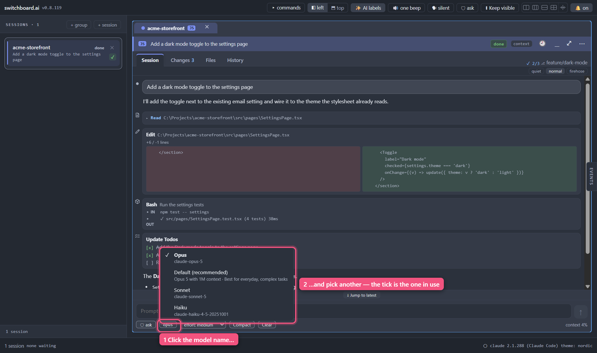

<a href="contents.md">☰ Contents</a>

# Choosing a model

Every session runs on a model — Opus, Sonnet, Haiku and so on. You can change
which one a session is using without restarting it or losing the conversation.

There are two ways in: a **one-click menu** on the model name itself, and a
fuller **picker** you open by typing a command. They list the same models. The
menu is quicker; the picker asks you to confirm.

## The quick way: click the model name

At the bottom of a session, next to the autonomy chip, there's a small button
showing the model that session is running — it looks like the buttons either
side of it, because it is one. **Click it.**

A short menu drops open — or opens upward, if the session is near the bottom of
the window — listing the models Claude Code will accept, with a **✓** on the one
you're on. **Click one and it switches straight away.** There's no OK button:
the menu closes, and the name on the button becomes the model you picked.

`Esc`, clicking somewhere else, or clicking the button again all just close the
menu without changing anything. `Tab` closes it too. You can walk it from the
keyboard with the arrow keys.

If the session hasn't answered anything yet, the button reads **model?** — you
can still open it and choose. See *When nothing is ticked* below for why.

One thing it won't do: while a switch is actually going out, the menu stays put
and won't close, and the button won't respond. That's deliberate — if Claude
Code refuses the change, the menu is where you'll be told, so it waits until
there's an answer to give you. It's normally too quick to notice.

## The fuller way: the picker

Type **`/model`** in a session's prompt box and press Enter.

The picker opens listing every model Claude Code will accept, with the name and
short description Claude Code itself gives each one. A **✓** marks the one this
session is running.

The command has to be on its own. `/model sonnet` goes to Claude Code as an
ordinary command, because you've asked it something more specific than "show me
the list".

### Switching

Click a model to select it, then press **OK**.

Clicking on its own doesn't change anything — it just marks your choice. Nothing
is sent to Claude Code until you press OK, which means **Cancel** (or `Esc`, or
clicking outside the picker) leaves the session exactly as it was. There's no
"undo" to hunt for, because nothing happened.

Once you press OK the change takes effect immediately, for **this session
only**, the picker closes, and the conversation carries on where it was. There's
no restart and nothing else to save. You'll see the new model name straight away
on the button along the bottom of the session.

If Claude Code refuses the change, the picker stays open and shows you what it
said, with your choice still selected — so you can try again, pick something
else, or cancel.

It does **not** change what new sessions start on. That's a Claude Code setting,
and switchboard doesn't touch it.

## When nothing is ticked

You'll sometimes open the menu or the picker and see no ✓, with a line
explaining why — and the button at the bottom of the session will read
**model?** rather than a name.

That's not a fault. Claude Code only says which model it's running as part of
replying to you, so a session that hasn't answered anything yet genuinely hasn't
told anyone. switchboard would rather say "not known yet" than tick a likely
guess and be wrong about the one thing you opened this to find out.

Two ways to clear it up: switch to a model (then it's ticked, because you chose
it), or send any prompt and look again.

## How hard the model thinks

Right of the model name there is a second small button: **effort: medium**, or
whatever level the session is on. It sets how hard the model thinks before it
answers. Higher levels are slower and use more of your allowance; lower ones
are quicker.

**Click it and pick a level.** There is no OK button. The new level applies
from your next prompt; you do not have to restart the session.

- **The levels are the ones Claude Code offers for that model.** Usually low,
  medium, high, extra high and max. Some models have fewer.
- **It shows what the session is really on.** The app asks the session,
  rather than remembering what you last clicked. If a level does not take,
  the button stays on the level that is in force and a short note beside it
  says so.
- **A model with no effort levels has no button.** Haiku 4.5 is one. Switch
  to a model that has them and the button comes back, on the level you had
  chosen before.
- **Your choice is remembered for that session's card.** Close the app, or
  let the session stop and start again, and the level is put back **when the
  card's conversation is next on screen**. A session that restarts while its
  card is folded away, or behind another tab, is on the default level until
  you look at it.
- **While the session is working the button is dimmed.** Change the level
  when the turn is over.
- **From the keyboard:** `Tab` to the button, then the arrow keys change the
  level.
- Like the model name, it is only there while the session is running.

## When the name is plain text

The model name at the bottom is **plain text, not a button**, on a session that
has **stopped** — there is nothing running to switch.

## If something goes wrong

| What you see | What it means |
|---|---|
| A message in Claude Code's own words | Claude Code refused the change and said why — usually a model your account can't use |
| "Claude Code didn't answer" | The session was busy or starting up. Try again in a moment |
| "That session has stopped" | The session ended while you had it open |

Whichever way you opened it, a refusal leaves the session exactly as it was and
stays on screen so you can read it — the quick menu holds itself open for that
reason.

---

[← Back to Contents](contents.md)
